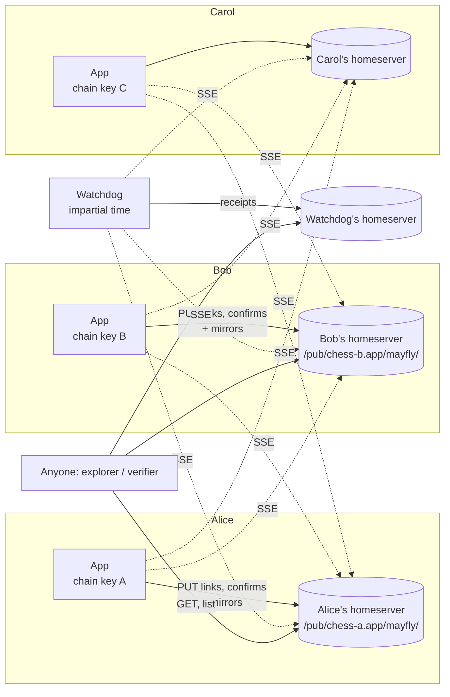

# Mayfly: a verifiable chain among a small set of parties, on Pubky

> Status: design proposal (v0.8). Six independent reviews so far; the sixth found no high
> findings, and its mediums reduced to one rule now stated in §6.8 and §11.2: *only an
> adjudicated close is final; every time verdict is provisional until the records it touches
> are, and is reached by the witness quorum, never by one receipt.* v0.3 answered the review of
> v0.2; v0.4 the review of v0.3 (eligibility, `subject` lists, empty-round death); v0.5 the
> review of v0.4 (`witnesses` needing the receipt it replaced; free skips); v0.6 the review of
> v0.5 (a dark witness plus a silent party; skip validity leaking into commitment). The review
> of v0.6 showed that every remaining witness finding, across three rounds, descended from one
> rule — a *required* witness whose receipt gated commitment — so v0.7 removes it: witnessing is
> a per-link, provable status (`m/k`) and a policy each party applies to its own vote, never a
> validity condition (§11.2), and a watchdog's failures are made provable rather than impossible
> (§11.6). Two principles now carry the design: *commitment consults votes only*, and *nothing
> waits for a third party*. §12 records every residual, including two kept by decision.
> The name is **Mayfly** (§17).

Mayfly is a protocol and engine for a **small, fixed set of parties** to build a shared,
verifiable history together. Every record (an *append*) is a signed, hash-linked link stored on
the author's own homeserver. A link is **committed** when, within one voting round, its
proposal plus the other parties' signed confirmations reach the quorum fixed at genesis —
**everyone, by default** — and the next link must embed those confirmations as proof before it
can be proposed. The result is a chain that behaves like a tiny blockchain among the parties —
one link at a time, no blocks, no timer, no miners, no shared server — that anyone with read
access to any party's `/pub/` storage can replay and check:

1. every link was signed by one of the established parties and permitted by the pinned rules,
2. every link reached the chain's quorum of confirmations in its round before the chain moved
   on, and the only thing ever recorded without a party's vote is that they stopped taking part
   (the *abandoned close*, §6.8),
3. nothing was inserted, removed, reordered or altered afterwards, and
4. the current state follows deterministically from the chain.

An optional impartial **watchdog** (witness) adds what the parties cannot give each other: proof
of *when* things happened, and proof that the parties did not later agree to rewrite history.

The first applications are a shared list, chess, and an agreed document with amendments. The
engine is rules-agnostic: rules are a deterministic pure function `apply(state, link) -> state`,
versioned and pinned in the chain's genesis.

---

## 1. Goals and non-goals

**Goals**

- No shared server. Parties talk only via their own homeservers and the Pubky SDK.
- Parties are established at genesis, so everyone knows exactly whom to wait for.
- Anyone can verify a chain offline from its files using only public keys embedded in the chain.
- Misbehaviour (forged, reordered, altered or forked links; double confirmations) is either
  impossible or produces cryptographic evidence that identifies the misbehaving key.
- Works with all three kinds of Pubky app: keyed Rust apps (`PubkySigner`), local grant sessions,
  and browser delegated grant sessions. No changes to the homeserver are required.
- A verifier fits in a few hundred lines in any language with Ed25519, BLAKE3 and base64url.

**Non-goals (v0)**

- Open membership or large groups. Confirm-before-proceed is unanimity; it suits 2–8 parties.
- Hidden information and strong randomness beyond commit-reveal.
- Proving *content* honesty. Two parties who agree to record a falsehood can do so; a chain proves
  what the parties agreed and when, not that it was true.
- Economic settlement. The chain is designed so a settlement layer could consume it.

---

## 2. What Pubky gives us (findings from this repository)

| Primitive | Where | Why it matters |
| --- | --- | --- |
| Per-user storage under `pubky://<user>/pub/<app>/...`; only that user's sessions can write | `docs/PRIVATE_STORAGE.md`, `openapi-client.yml` | Each party writes to their own store; the write is authorised by the homeserver. |
| Public reads of `/pub/` by anyone, no auth | `PublicStorage::get/list` | Verifiers and bystanders need no account. |
| `ETag` is the **BLAKE3** hash of the file content, as a quoted, padded, *standard* Base64 string | `routes/tenants/read.rs` | If a link file *is* the signed link, the file's ETag *is* the link hash — same 32 bytes, different encoding from the base64url used in payloads (§6). |
| SSE `/events-stream` with `path` filter, `live=true`, and a `content_hash` (BLAKE3, standard Base64) per PUT | `pubky-sdk/src/actors/event_stream.rs`, `events_entity.rs` | Real-time notification of appends and confirmations; the event already carries the record hash. |
| Directory listing, lexicographic, paginated, `shallow`/`reverse` | `ListBuilder` | Zero-padded sequence numbers make listing return links in order. |
| Ed25519 keys, BLAKE3, JWS (EdDSA) helpers | `pubky-common/src/{keys,crypto,auth/jws}.rs` | `sign_jws`, `jws_signing_input`, `finish_jws`, `decode_jws_payload` reused verbatim. |
| Grant auth: user-signed Grant JWS binds a **client key** (`cnf`) to the user | `pubky-common/src/auth/grant.rs` | Delegation is already a first-class idea; informs the key design in §5. |
| Events limited to 50 users per stream; no conditional `PUT` (`If-Match`) | `event_stream.rs`, `routes/tenants/write.rs` | Concurrency is handled by the protocol's commitment rule, not by the server. |
| A path cannot be both a file and a folder prefix | `pubky-sdk/README.md` | Layout in §7 keeps files and folders disjoint. |

Two consequences shape everything else:

- **Location is authorisation, signatures are proof.** A file under Alice's storage was written by
  a session Alice authorised, but a verifier never relies on that: homeservers can be compromised
  and files are mutable. Every link and confirmation is self-certifying (signed).
- **Storage is mutable and deletable.** History integrity comes from the hash chain, from every
  other party holding (and mirroring) each link, and from watchdog receipts — not from the
  homeserver refusing edits.

---

## 3. Prior art and what we take from it

- **Holochain countersigning.** 2–8 agents lock their chains, agree a single entry and all sign
  it; nobody's state changes unless everybody's does. Our confirm-before-proceed rule is the same
  idea expressed as files on homeservers; a failed round (§6.4) plays the part of Holochain's
  session abort.
- **BFT chains (quorum certificates).** Each block carries the votes that committed the previous
  block. Our links embed the confirmations of their predecessor, so a chain read from files alone
  proves every link but the head was committed.
- **Sigsum / C2SP tlog-witness.** Witnesses cosign a log's head after checking only that it is
  append-only and consistent with what they saw before; m-of-n witnesses defeat split views. Our
  watchdog is exactly this posture: semantics-free, timestamped, cheap.
- **Triple-entry accounting (Grigg).** "The receipt is the transaction": once every party holds
  the same signed record, bookkeeping reduces to presence or absence. Our confirmations are the
  receipts.
- **Jester / NIP-64, NutChain (Nostr games).** Signed, hash-linked moves and rules as a pure
  function over the chain. We take the structure and add explicit confirmation.
- **Scuttlebutt.** Per-author signed feeds and fork detection. We deliberately do *not* take its
  concurrent DAG ("tangle"): confirm-before-proceed keeps the chain linear.

---

## 4. Architecture overview



**The core rule.** A chain advances one link at a time, and each `seq` is decided in numbered
**rounds** (§6.4):

1. In round `r` of seq `n`, an eligible party *proposes* link `n` by signing it (with
   `prev = hash(link n-1)`, `round = r`, and the quorum certificate that committed `n-1`
   embedded) and writing it to their own storage.
2. Every other party validates it and, if valid, writes a signed *confirmation* for that link
   and round to their own storage. A party who will not confirm writes a signed *reject*.
   Every party casts at most one vote per round, and votes are never taken back.
3. Link `n` is **committed** when its proposal plus confirmations in the same round reach
   `confirm_quorum` `q` (default `N`: everyone). Those votes are its **QC**. Only then may
   anyone propose `n+1`, and `n+1` must embed the QC as proof; once `n+1` itself has a QC,
   link `n` is **final**.
4. If a round can no longer reach `q` — two parties proposed different links, or someone
   rejected — that evidence is itself in the files, the round is **dead**, and round `r+1`
   begins with a single designated proposer chosen by rotation.

The one exception to "nothing commits without everyone" is the **abandoned close** (§6.8): the
parties who are still present may end the chain against those who have stopped responding, and
the rules turn that into an outcome (a loss by default, a list archived).

Who may propose *rules* content is a rules question (chess: only the player to move; a shopping
list: any member). Protocol kinds — `reveal`, `rekey`, `recover`, `close`, and `witnesses`
(which replaces a watchdog that has gone dark, §11.2) — have their own eligibility (§6.4) and
are never gated by the rules. The commitment rule is the same for every rules type.

Components: **rules engine** (pure, deterministic, versioned), **chain** (links plus
confirmations; verification is a fold), **transport** (Pubky storage and SSE), **key binding via Grant**
(§5), **watchdog** (§11), **explorer** (§14).

---

## 5. Parties and keys

### 5.1 The problem

Links must be signed by a key that any verifier can tie to a Pubky identity, offline, without
trusting a homeserver. The identity keypair itself normally lives in an authenticator (Pubky
Ring) and is never available to a browser app, so the app must sign with a key of its own and
carry proof that the identity delegated to it.

### 5.2 Design: the Grant client key is the chain key

Pubky already issues exactly that proof. In grant-based auth (`pubky-common/src/auth/grant.rs`)
the user's identity key signs a **Grant JWS** whose `cnf` claim is the app's client public key,
together with `client_id`, capabilities, `iat` and `exp`. Every app — keyed, local-grant or
browser-delegated — holds a Grant and controls the `cnf` key. Mayfly therefore uses:

- **chain key** `kid` = the Grant's `cnf` key, and
- **attestation** = the Grant JWS itself, unchanged.

A verifier checks a record in three steps, all offline: verify the Grant JWS under `iss` (the
party's pubky); check `cnf == kid` and that the Grant's capabilities include write access to the
folder the party declared for this chain (`path`, §7 — normally the app's own
`/pub/<client_id>/:rw`; a Grant that could not have written the record is not evidence of the
party's intent to take part); verify the record under `kid`. No file lookup, no homeserver, no
argument from where a file was found.

What a verifier does **not** do is compare the record's `ts` with the Grant's `iat..exp`. `ts`
is chosen by the signer, so that comparison would be a control the signer administers: anyone
holding a lapsed Grant's `cnf` key could backdate `ts` into the window forever. Expiry is
enforced by clocks the signer does not control:

- **Counterparties' clocks, at confirmation time.** A client never confirms a record whose
  signing Grant has expired or been revoked by its own clock. Under unanimity a backdated record
  therefore needs every honest counterparty to be fooled, and they are not consulting `ts`.
- **Watchdog receipts, at verification time.** Where receipts exist, a record `observed_at`
  after its Grant's `exp` (or after a revocation was observed) is invalid, and a Grant used
  within its window is proven so.
- **The homeserver, at write time**, refuses sessions on expired Grants, which is why honest
  parties `rekey` before expiry (§6.7) — but a verifier never relies on that, since a record can
  arrive from a mirror.

`ts` remains in every record as the signer's own claim of when they acted: useful for display and
for a client's local ordering, never for consensus. Ordering is `seq` and `prev`. Units: `ts`
is Unix **milliseconds** (as SSE cursors and `observed_at`); Grant `iat`/`exp` are Unix
**seconds**, as issued by `pubky-common`; implementations convert explicitly and never compare
across.

Why this beats a separately generated key:

| | Separate chain key | Grant `cnf` key |
| --- | --- | --- |
| Identity-signed binding in the browser | Impossible without a new Ring feature | Already exists |
| Extra key material to manage | Yes | No |
| Verifier trust in homeserver | Needed for "location" binding | None |
| Reuse of an auth key | — | Mitigated by JWS `typ` domain separation (below) |

Requirements and mitigations:

- **SDK: sign with the client key.** The SDK signs PoP proofs with this key but exposes no
  general signer (`GrantPopSigner::sign_jws` is `pub(crate)`). Add
  `GrantCredential::sign_jws(typ, claims)` covering both local keypairs and the delegated
  browser signer (`__pubkyGrantDelegatedSign` already signs any JWS input). This is a thin wrapper
  and the one SDK change the design depends on.
- **What opening that signer means.** Today a Grant's `cnf` key can only produce PoPs, i.e.
  write files. With `sign_jws` it can produce statements *as the user* — a chess result, an
  acceptance of a document — and any script running in the app's origin can too. Three
  containments: the SDK method refuses `typ` values in the `pubky-*` namespace and requires the
  app's own prefix, so a chain record can never become a session and a compromised session
  cannot forge protocol-level Pubky material; a record still needs the counterparties'
  confirmations and the rules' validity, so a forged chess move must be a legal move and a forged
  document acceptance is visible to the counterparty whose document it is; and the blast radius
  is one `kid`, ended by revoking the Grant in Ring. The remaining gap is disclosure: Ring users
  consent to storage capabilities, not to "this app may sign records in my name". The Grant's
  `client_id` in every record makes the signer's app visible after the fact; Ring showing the
  signing power before the fact is the right fix and is raised in §18.
- **Domain separation.** Mayfly records use `typ` values `mayfly-link`, `mayfly-confirm`,
  `mayfly-reject`; PoPs use `pubky-pop`. Verifiers reject any other `typ`, and the homeserver
  already requires PoP claim shapes, so a chain record can never pass as a PoP or vice versa.
- **Publishing the Grant is safe.** Without the `cnf` private key a Grant authorises nothing; only
  the stored credential *including* the client secret is bearer-equivalent. The Grant does reveal
  `client_id` and capability scope, which is acceptable and often useful ("signed by Alice's
  chess app"). Note that a Grant has no audience: it is valid at every homeserver in the user's
  pkarr record, so a stolen `cnf` key plus its Grant can write wherever the user is hosted. That
  is a property of Pubky auth, not of this design, and is why revocation in Ring is the answer to
  key theft.
- **Lifetime.** Grants expire and users can revoke them in Ring. A chain that outlives a party's
  Grant uses a `rekey` link (§6.7), signed by the old key and carrying the new Grant; a party
  who has actually lost the key uses `recover`, which is deliberately slow and never automatic.
  A `rekey` must land **before** `exp`: after it, the old key's signature on the rekey is itself
  outside its window (§9.2 step 4), and under unanimity so is every QC the party has since
  joined — when the head falls to a window verdict the seq before it loses its successor and is
  provisional again, so the whole tail after `exp` falls with it. Past `exp`, `recover` is the
  only way back.
- **Seat identity.** A party's seat is bound to more than their pubky: the verifier records the
  `client_id` of the Grant that took the seat at genesis, and a `rekey` must present a Grant with
  the same `iss` **and** `client_id`. Another app's Grant for the same pubky — a notes app, a
  phished sign-in — is not the same seat.
- **Keyed apps** (Rust CLI with `PubkySigner`) issue themselves a Grant with `sign_jws`; the
  identity key is then only ever used to sign Grants, and one verifier path covers every app type.

### 5.3 The attestation travels with the chain

A verifier must never depend on a file the party can delete. So:

- Each party's **genesis confirmation embeds their Grant JWS** (§6.2). Link 1 embeds the genesis
  confirmations, and every party mirrors committed links, so once one link has committed every
  party's storage holds every party's key binding. Deleting a file afterwards destroys only the
  deleter's copy.
- A `rekey` link embeds the new Grant the same way.
- `keys/` in storage (§7) is for **discovery and revocation only**: the current Grant so a new
  counterparty can find it, and an affirmative signed `revoked` record. Deletion hides nothing
  and revokes nothing. A `revoked` record (`typ: mayfly-revoke`, naming the revoked `kid`) is
  signed by **another key the same identity has attested** — any current Grant's `cnf` under the
  same pubky, with that Grant embedded — since the identity key itself is not available to an
  app and the compromised key cannot be trusted to disown itself. It is a **`keys/` file, not a
  chain link**: it has no `seq`, is not a candidate in any round (§6.4), and never enters the
  fold as a vote. Its two effects are: a client that sees it stops confirming records by that
  `kid` (the co-signers' clocks, §5.2), and a watchdog — which watches `keys/` as well as the
  chain folders — receipts it, after which any record by that `kid` observed later is invalid
  (§9.2 step 4). Revoking in Ring remains the authoritative act; this record is how the chain's
  counterparties learn of it.

  ```json
  { "v": 1, "kind": "revoked", "revoked": "<the disowned kid>",
    "by": "<the signing kid — cnf of grant>", "grant": "<Grant JWS under the same pubky>",
    "ts": 1757779812345 }
  ```

  A verifier accepts at most one per `kid` it has established for that party, and checks the
  Grant under the party's pubky with `cnf == by` and write capability on their folder, then the
  signature under `by`.

| Key | Holder | Used for |
| --- | --- | --- |
| Identity key | Authenticator (Ring) or keyed app | Signing Grants (unchanged) |
| Grant client key (`cnf` = `kid`) | App | Homeserver PoP (unchanged) **and** signing Mayfly records |

---

## 6. Data model

All records are JWS compact strings (`base64url(header).base64url(payload).base64url(sig)`,
header `{"alg":"EdDSA","typ":"mayfly-<type>"}`) stored as the raw file body. This means: no
canonicalisation problem (signed bytes are stored bytes); `hash = BLAKE3(file bytes)` is the
same 32 bytes as the homeserver `ETag` and the SSE `content_hash`; and verification in any
language is split, decode, Ed25519 verify, JSON parse.

**Why not readable JSON on disk.** A generic file browser shows a compact JWS as an opaque
string, and it is tempting to store `{alg, typ, payload, sig}` with the payload in clear
instead. That was tried and reverted: the signed bytes become a *substring* of the file, so a
verifier needs a JSON parser that hands back the exact byte range of `payload` (`JSON.parse`
does not), or it re-serialises and quietly reintroduces the canonicalisation problem this
section exists to avoid; the protected header is no longer stored but re-synthesised, so
verification silently depends on every signer emitting byte-identical header JSON; and the
format is no longer RFC 7515, so the JOSE library that verifies a Grant cannot verify a record.
Storage was not the issue (base64url costs about a quarter more than clear JSON). Readability
is the explorer's job (§14): it decodes header and payload, checks the signature and the hash,
and shows the raw JWS beside them.

**Hash encoding.** The homeserver writes that hash as quoted, padded, *standard* Base64 in the
`ETag` header and as unpadded standard Base64 in `content_hash`; payloads write it as unpadded
**base64url**. Same bits, three spellings. Implementations decode to 32 bytes and compare
bytes; a client that compares strings will either fail closed on every honest record or, worse,
be talked into skipping the check. Filenames use a Crockford Base32 prefix of the same bytes
(§7).

**Parsing rules.** Storing signed bytes removes canonicalisation from *signing*, but every
verifier still parses the payload, and two honest verifiers must not read different values from
the same bytes. A payload is invalid — and the record is not a candidate or a vote — if it has
duplicate keys at any level; an integer outside `0 ..= 2^53 − 1` (so JavaScript and Rust agree
on `seq`, `round`, `ts` and quorum); a number with a fraction or exponent in an integer field;
a string that is not valid UTF-8; or an unknown top-level field for its `v`. Strings are
compared as bytes, never Unicode-normalised. Records over `max_body_bytes` (§6.6) are invalid
before parsing.

### 6.1 Link (`typ: mayfly-link`)

```json
{
  "v": 1,
  "chain": "<chain_id>",
  "seq": 7,
  "round": 0,
  "prev": "<hash of link 6>",
  "confirms": ["<confirmation JWS for link 6 by Bob>", "<... by Carol>"],
  "author": "<party pubky z32>",
  "kid": "<author's chain key z32>",
  "ts": 1757779812345,
  "kind": "move",
  "body": { "...": "rules-specific" },
  "state": "<hash of canonical state after applying this link>"
}
```

- `round` is the voting round at this `seq` in which the link is proposed (§6.4); almost always
  `0`. Proposing is the author's vote in that round.
- `confirms` embeds the full confirmation JWSs that committed `prev` (the quorum certificate,
  QC). All of them carry the same `round` as link `prev`; the array is sorted by confirmer `kid`
  (lexicographic byte order of the z-base-32 string) so that two parties embedding the same QC
  produce identical bytes. Genesis has `prev = ""`, `confirms = []` and no `chain`: its id is
  derived from its own bytes (§6.5), so it cannot carry it.
- `receipts` embeds, for each engaged witness whose receipt the author **holds**, its receipt
  for the **QC-completing confirmation**: the member of `confirms` with the greatest
  `observed_at` in that witness's receipts, ties broken by lower `kid`. That is the moment
  `prev` committed as the watchdog saw it — not the last array element, which the sort makes the
  highest `kid`. The array is sorted by witness `kid`, may be empty, and is never required to
  be complete (§11.2): the verifier validates each receipt present, under the engagement key it
  names, and never asks whether one is missing. Embedding is for durability — it puts the
  watchdog's timestamp inside the chain, where every party mirrors it (§11.4).
- `state` is **mandatory**: `BLAKE3(rules.canonical_state(apply(state, link)))`. It pinpoints
  the exact link where two rules implementations diverge. It is mandatory rather than
  recommended because it is inside the signed bytes: if it were optional, two correct clients —
  one including it, one not — would produce two different proposals for the same content at the
  same `seq` and send an honest chain through a dead round for nothing. For `rekey`, `recover`,
  `reveal` and `close`, which do not reach `apply`, `state` repeats the previous link's.
- The genesis link additionally carries `"grant": "<initiator's Grant JWS>"` (§5.3); a `rekey`
  link (§6.7) carries the author's new Grant the same way.

### 6.2 Confirmation (`typ: mayfly-confirm`)

```json
{ "v": 1, "chain": "<chain_id>", "seq": 7, "round": 0, "link": "<hash of link 7>",
  "kid": "<confirmer's chain key>", "ts": 1757779813200,
  "state": "<hash of the confirmer's own canonical state after link 7>",
  "grant": "<Grant JWS — genesis confirmations only>",
  "path": "/pub/<client_id>/mayfly/ — genesis confirmations only: where my records live (§7)",
  "commit": "<BLAKE3(nonce) — genesis confirmations only, when the rules want randomness (§6.6)>" }
```

"I have validated link 7 and vote for it in round 0 of seq 7." `round` must equal the link's
`round`. A confirmation is final within its round: it is never taken back. A party changes its
mind only by voting differently in a *later* round, which exists only once the current round has
provably failed (§6.4).

- `state` is the confirmer's *own* computation, so a mismatch with the link's `state` is
  information, not a veto: **the confirmation is still a valid vote**, and the mismatch is an
  anomaly the verifier reports against the pair (one of the two implementations is wrong; the
  rules hash in genesis, §6.6, says which one deviated from the reference). If a mismatch
  silently invalidated the vote, a confirmer could wedge any link by publishing a wrong hash,
  and confirmations are final — the wedge would be permanent. A client that computes a
  different hash should normally *reject* rather than confirm; confirming with a mismatch is
  the case where it did not notice, and the chain must not stall on that.
- In a **genesis confirmation** `grant` and `path` are mandatory: the Grant is the confirmer's
  key attestation and the only place a verifier learns their `kid`; `path` is the folder under
  which their records for this chain will be found (§7), and must lie within that Grant's write
  capability. Since link 1 embeds all genesis confirmations, every party's Grant and folder are
  in the chain itself from the first committed link onwards.

### 6.3 Reject (`typ: mayfly-reject`)

```json
{ "v": 1, "chain": "<chain_id>", "seq": 7, "round": 0,
  "link": "<hash of the refused link, or \"\" for a pass>",
  "kid": "<rejecter's chain key>", "ts": 1757779813500 }
```

"I vote for nothing in round 0 of seq 7." A reject is the third kind of vote, and like the others
it is final within its round. It has three uses:

- **Refusing a proposal** (`link` set): the proposal is invalid, or the party prefers a different
  one and wants the round to end so a designated proposer can take over.
- **Passing** (`link` empty, by a designated proposer of this round): "I have nothing to propose
  here", so that the round can end and the next proposer take over.
- **Skipping** (`link` empty, by anyone else, round `≥ 1` only): "the designated proposer has
  not acted and I am moving on". This is how rotation gets past a proposer who is silent. A
  round with no proposal dies either by its designated proposer's pass or by a skip (§6.4). A
  skip is bounded (§6.4): one per party per `seq`, never in round 0. A pass is not so bounded —
  a designated party may always give up its own turn — and the two budgets are separate: a party
  who has skipped once may still pass when designated, and vice versa. A skip is a reject and
  therefore a record: it is **presence** for the skipper at that `seq` (§6.8), and it does not
  reset the silence of the party skipped (§11.3).

One reject is not a round vote at all: a reject at a `seq` where a `recover` for the rejecter's
own seat has been proposed, signed by their **established** key, is a **veto** of that recover
(§6.7). It does not count toward one-vote-per-round, it does not kill the round, and a verifier
records it as a veto, never as equivocation.

There is no withdrawal. A proposer cannot retract a proposal; their vote for it is as final as
anyone's confirmation. If they regret a valid proposal they ask a counterparty to reject it
(the UI's "cancel" does this) or let it commit and append a correction. This is deliberate: a
retractable vote is a vote change with no ordering, and it is exactly what let honest parties
strand each other in earlier drafts.

### 6.4 Commitment and voting

Each `seq` is decided in numbered **rounds**, `0, 1, 2, …`. In round `r` of seq `n`:

- **Votes.** A party casts at most one vote. Proposing a link with `round = r` is the author's
  vote for it; a confirmation with `round = r` is a vote for the link it names; a reject with
  `round = r` is a vote for nothing. Votes are final: nothing in the protocol ever counts a vote
  as taken back.
- **Quorum certificate (QC).** A link with `round = r` is **committed** when it holds the
  author's proposal plus confirmations in round `r` from enough other parties to reach
  `confirm_quorum` (default `N`, unanimity). Those confirmations, embedded in link `n+1`, are
  the QC.
- **Death.** Round `r` is **dead** once the votes cast in it make a QC impossible. With at least
  one proposal in the round: for every link `L` proposed, `votes(L) + (N − parties who have
  voted) < q` — under unanimity, one reject or any two votes for different links. With **no
  proposal** in the round the condition is *not* evaluated over the empty set (that would make
  every round dead at inception); instead the round is dead when it holds at least `N − q + 1`
  rejects — under unanimity, a single pass or skip (§6.3). A round dies by signed evidence in
  the files, never by a clock, so every verifier reaches the same conclusion; a silent
  designated proposer is got past by a skip, not by waiting.
- **Who may propose rules content.** Round 0: any party for whom
  `Rules::may_append(state, party, kind)` is true for the kind proposed (chess: `move` by the
  side to move, `resign` or `offer_draw` by either side; a list: anything by any member).
  Round `r ≥ 1`: exactly one **designated** party, chosen by rotation over **all parties in
  genesis order**:
  `parties[(u64_be(BLAKE3(ascii(chain_id) ‖ u64_be(seq))[0..8]) + r) mod N]`, where `ascii()`
  is the 26 Crockford characters as bytes and `u64_be` is an 8-byte big-endian integer. The
  designated party may propose rules content only if `may_append` allows it that kind; otherwise
  they pass (or propose a protocol kind). Rotating over all parties rather than a rules-derived
  list means the rotation set is never empty and never depends on state the rules may not have
  yet — and it means that in chess the designated party in round `r ≥ 1` **may be the opponent**,
  who passes, so that a dead round costs at most one pass before the mover is designated again.
  `Rules::obliged(state)` (§10) is separate from eligibility: it names who is *expected* to
  propose (chess: the side to move; a list: nobody) and feeds only the stopwatch (§11.3).
- **Who may propose protocol kinds.** Never gated by the rules, in any round:

  | Kind | Eligible |
  | --- | --- |
  | `reveal` | The next party in `parties` order who has not revealed (§6.6); nobody else |
  | `rekey`, `recover` | The seated party, for its own seat, at any `seq` |
  | `close {finished}` | Any party, once `Rules::status` is `Finished` |
  | `close {agreed}` | Any party |
  | `close {abandoned}` | Any non-subject party; judged outside rounds (§6.8) |
  | `witnesses` | Any party (§11.2); `add` and `remove` not both empty; commits only with every party's confirmation of that link — under `q < N`, `q` is `N` for this kind (§9.2 step 3b) |

  In round `r ≥ 1` a protocol kind still needs its author to be the designated party, except
  `reveal` (whose author is fixed) and `abandoned` (outside rounds). A protocol proposal
  competing with a rules proposal in round 0 simply kills the round like any other competitor;
  clients avoid that by proposing `rekey` when no rules proposal is pending.
- **Skips are bounded.** A skip (§6.3) exists to get past a silent designated proposer, and
  nothing else, so: it is valid only in round `r ≥ 1` (round 0 has no designated party; a
  round-0 with no proposal simply waits, and in chess the mover's round 0 can never be skipped
  from under them); and a party may skip **at most once per `seq`**, so `N − 1` skips is the
  most any `seq` can be pushed, after which only the skippers remain to be designated and the
  party who was skipped is designated again within a round or two. A second skip by the same
  party at a `seq` is not a vote. Whether a valid skip was *fair* — whether the designated party
  had been silent for the rules' `think_ms` (default 24 h when `time_control` is absent,
  §11.3) — is judged by receipts as an **anomaly** against a premature skipper, and deliberately
  **not** as a validity condition: if a skip's validity depended on receipts, so would round
  death, and so would which link is committed, and two verifiers with different receipt sets
  would fold different chains. Commitment depends on votes alone (step 3d in §9.2 consults QCs,
  never death evidence). An empty reject that arrives in a round where the designated party
  **acted** — proposed or passed — is not a skip at all but an ordinary vote for nothing: it
  spends no skip budget and is never premature, since nobody silent was skipped; it kills the
  round, and is **obstruction** if there was a valid proposal (§11.3). Under `q < N` this is
  how the remaining `N − q` rejects that kill a passed-on round arrive (§6.4). The residual is
  therefore a party spending its one skip per
  `seq` — costing the skipped party at most two rounds — and then obstructing in the open, which
  the files prove without any clock.
- **Entering a round.** An honest party votes in round `r + 1` only after it has seen round `r`
  die. The designated proposer re-proposes **the lowest-hash link that received any vote in the
  dead round**, with `round = r + 1` and the same `prev`; if no link received a vote (the round
  died by pass or skip), it proposes its own queued intent, or passes. Honest parties therefore
  converge in at most two rounds at any `seq`.

Which link is committed at a `seq`:

- **Within a round** two QCs are impossible without double votes: `2q` votes from `N` keys
  means at least `2q − N` parties voted twice (under unanimity, all of them).
- **Across rounds**, if a link at `seq + 1` has a QC, the link at `seq` is the one whose QC it
  embeds — that link is **final**, and any later-surfacing vote at `seq` is an anomaly
  attributable to its signer, not an input. Otherwise the committed link is the QC in the
  **highest round**; it is the **provisional head** until a successor commits.

Discipline for honest clients, which is what makes the above safe:

1. Never vote twice in a round. Never vote in round `r + 1` without evidence that round `r` is
   dead.
2. Once you have seen a QC at seq `n`, cast no further votes at `n` in any round. Propose or
   confirm `n + 1` on the highest-round QC you know of.
3. On seeing a link at `n + 1` with a valid QC, adopt its `prev` as the committed link at `n`,
   whatever you believed before.
4. Treat the head as provisional. Anything with consequences outside the chain waits for the
   link to become final; for a chain's last link, see §8.4.

Consequences:

- **Honest parties never strand each other.** The three-party trace that broke earlier drafts
  (Carol confirms Alice's link; Bob's lower-hash link arrives; Alice would have had to abandon
  hers, leaving Carol's vote spent) now ends round 0 with two votes for different links; the
  round is dead by evidence, and round 1 has one designated proposer whom everyone confirms.
- **Rounds are "replaceable confirmations" done safely.** Replaceable votes without an
  ordering let three honest parties all confirm `L`, then all switch to a lower `L'` before
  anyone had read all three confirmations — two full QCs at one `seq`. A round number orders the
  replacement, and death evidence gates it.
- **A dishonest party gains nothing from equivocating.** Two votes by one key in one round are
  a signed contradiction; the votes still count (a QC is a QC), so publishing a second vote
  cannot dissolve a commitment. What a dishonest party *can* do is withhold a vote and reveal it
  later; the worst case is that the **provisional head** changes once, which rule 4 makes
  harmless and rule 3 makes convergent. Nothing final ever changes.
- **Griefing is bounded and attributable.** A party who proposes a competing link at every
  `seq` kills round 0 every time, but round 1 has one designated proposer, so each `seq` costs
  at most one extra round unless the griefer is designated — in which case they propose junk,
  are rejected, and rotation moves on. The only way to stop the chain is to reject every valid
  proposal, and a reject of a link the verifier can show was valid is **obstruction**: it counts
  against the rejecter exactly as silence does (§11.3), and makes them the subject of an
  `abandoned` close. Obstruction is judged per round and only when the refused link was the
  **sole** proposal in that round: with competing proposals, refusing one so that the round
  ends and rotation decides is what §6.3 permits, and a verifier does not count it. A party
  who refuses the sole valid proposal in round 0 and again the designated re-proposal in round
  1 has obstructed twice, in the open.
- **Quorum mode.** Genesis may set `confirm_quorum: q < N` (votes including the author,
  `q > N/2`). This tolerates parties who are merely offline; it is *not* analysed here for
  dishonest parties, because the locks above rely on every party's vote being needed. Chains
  with stakes should use unanimity. One liveness consequence is worth knowing: round 0 has no
  skips, and a round with proposals dies only when no link can still reach `q`, so under
  `q < N` a **silent party keeps round 0 alive** whenever their vote could complete a QC. With
  `N = 3, q = 2`, two competing proposals and a silent third party leave the `seq` waiting on
  that party — or on an `abandoned` close naming them — where unanimity would have killed the
  round at once. With `N ≥ 4` the present parties can still kill it by refusing (each `L` then
  has `votes(L) + 1 < q`).

Genesis is committed the same way: the initiator proposes link 0 (round 0, no rotation) naming
every party; each other party confirms it (their confirmation is their acceptance and carries
their `kid` and, if the rules want randomness for seat assignment, a `commit` to a nonce they
reveal later, §6.6). A reject at
genesis declines the invitation. A chain whose genesis never commits never existed.

### 6.5 Chain id

```
chain_id = crockford_base32( BLAKE3( genesis_link_bytes )[0..16] )   // 26 characters
```

Same construction as `pubky-app-specs` hash ids. Every later link carries `chain`, so links can
never be replayed across chains.

### 6.6 Genesis body

```json
{
  "rules": "chess/1",
  "rules_hash": "<BLAKE3 of the reference rules module for chess/1>",
  "max_body_bytes": 65536,
  "parties": [ { "pubky": "<alice>", "kid": "<alice kid>", "role": "white" },
               { "pubky": "<bob>",   "role": "black" } ],
  "nonce": "<16 random bytes b64url>",
  "confirm_quorum": 2,
  "witnesses": [ { "pubky": "<watchdog>" } ],
  "recovery_delay_ms": 172800000,
  "options": { "time_control": { "think_ms": 259200000, "respond_ms": 86400000 } }
}
```

Only the initiator's `kid` (and Grant, in the link's `grant` field) is known at genesis; the
others arrive in their confirmations. Roles are rules-defined strings. A party entry may also
carry `"path": "/pub/<app>/mayfly/"`, the initiator's guess at where that party will write —
a discovery hint for their confirmation before link 1 embeds it (§9.1), never checked.

**A genesis confirmation is key discovery as well as a vote.** Under `q < N` genesis may commit
before every party has confirmed; a party whose confirmation arrives afterwards is no longer
voting, but their confirmation is still the only place their `kid`, `client_id` and `path`
appear (§5.3), so an honest client publishes it anyway, and a verifier **seats a party from any
valid genesis confirmation it finds**, inside the genesis QC or not. Such a confirmation is not
a late-vote anomaly. Because link 1 may already exist without it, every party mirrors it as
they mirror a QC (§7); until then it lives only in the confirmer's own folder.

**A genesis confirmation is consent to the fault model, not just to the membership.** The
initiator writes the genesis body alone, and several of its fields decide what the chain can
later do to the confirmer: `confirm_quorum` (how many parties can commit without me),
`witnesses` (whose clocks adjudicate against me), `recovery_delay_ms`
(how fast my seat can be taken), `options.time_control` (how long before I can be closed out),
and `rules` (what is valid at all). A client shows these before the user confirms, and
**refuses** to confirm — and a verifier treats the genesis as invalid, so the chain never
existed — when:

- `confirm_quorum` is absent, `≤ N/2`, or `> N` (with `q ≤ N/2` two disjoint groups could each
  commit; this is a safety parameter, and the default `N` is the only value analysed for
  dishonest parties, §6.4);
- `parties` has duplicates, fewer than two entries, or does not include the confirmer;
- `rules` is unknown to the client, or `rules_hash` is absent or does not match the client's
  reference module;
- `max_body_bytes` is absent, or larger than the client is willing to fetch (default cap: 1 MiB);
- `recovery_delay_ms` is below the client's floor (default: 24 hours).

Anything a confirmer would not accept in a genesis it has to reject *at genesis*; there is no
later point at which these parameters are renegotiated.

**`rules_hash`** pins the rules by content, not by name. Each rules id has one **reference
module** — the WASM build of `pubky-mayfly-rules` for that id, published with the release —
and `rules_hash` is its BLAKE3. A client confirms genesis only if it runs that module, or an
implementation that passes the conformance fixtures shipped with it. `state` hashes on every
link (§6.1) then catch any implementation that drifts from the reference, and the pinned hash
says which side is the reference. Without this, `chess/1` is whatever the initiator's client
thinks it is.

**`max_body_bytes`** bounds every record: a verifier checks the size (`stats()` or
`Content-Length`) before fetching and treats anything larger as invalid without reading it.
Blobs live outside the chain, referenced by hash. Verification work is further bounded per
source (§9.2 step 2).

**Seat randomisation** (chess, when `role` is not fixed) must not be selectable by whoever
signs last. Each genesis confirmation therefore carries `commit: BLAKE3(nonce)` rather than
the nonce. Once genesis commits, each party in `parties` order appends a protocol-level
`reveal {nonce}` link (seqs `1..N-1`; the sole eligible proposer is the next unrevealed party,
so there is nothing to race), the verifier checks `BLAKE3(nonce) == commit`, and the seats are
`BLAKE3(genesis.nonce ‖ nonces in party order)`. Nobody learns anyone else's nonce before their
own commitment is in a committed genesis. A party who never reveals is the subject of an
`abandoned` close before the game has begun. The initiator's `genesis.nonce` is public from the
start and adds nothing an initiator could grind against; it merely domain-separates chains.

### 6.7 Rekey

Two protocol-level link kinds, available under every rules id, replace a party's chain key. They
differ in who signs, and that difference is the whole security story.

**`rekey` — renewal, signed by the old key.**

```json
{ "kind": "rekey", "body": { "new_kid": "<new cnf key z32>" }, "grant": "<new Grant JWS>" }
```

The link is signed by the party's **current** key, so it carries the same authority as any other
link of theirs; the new Grant is checked like a genesis Grant (§5.2) and must additionally have
the same `client_id` as the Grant that took the seat. Counterparties may confirm it
automatically. From the next `seq` that party's records must use `new_kid`. This covers the
common case — a browser profile migrated, a device replaced while the old one still works, and
(rarely, since the SDK's default Grant lifetime is two years) a Grant approaching `exp`. Note
that the trigger is **device change, not expiry**, and it would be the same under any scheme
whose key lives in the app: a separately generated, non-expiring chain key would move between
devices no better than the Grant's `cnf` key does. What would remove it is a stable key held by
the authenticator (§18).

**`recover` — loss, signed by the new key, and slow on purpose.**

```json
{ "kind": "recover", "body": { "new_kid": "<new cnf key z32>", "path": "/pub/<new client_id>/mayfly/", "note": "<optional>" },
  "grant": "<new Grant JWS>" }
```

`path` is where the party's records live from the next `seq` (§7): a new `client_id` is a new
app and therefore a new folder, and the verifier checks the path lies within the new Grant's
write capability. Mirrors of earlier records stay where they were; the verifier reads a party's
history from every folder they have declared, in order.

`note` is optional and **public forever**: it is plaintext in a JWS under `/pub/`, mirrored by
every party and any watchdog. A client labels the field as such before the user types into it,
and a user who merely needs a seat change should leave it empty rather than record a permanent
admission of key compromise. The out-of-band check the counterparties perform (below) does not
depend on it.

A link signed only by a key the chain has never seen is, on its face, indistinguishable from a
takeover: any Grant the identity has ever issued to any app — or one obtained through a phished
sign-in — would do. Earlier drafts accepted it on the strength of the Grant alone, which made
every seat as weak as the user's weakest app. So `recover` rests on evidence the Grant cannot
supply:

- **The old key can veto — until the recover is final.** A `reject` at that `seq` signed by
  the party's established key voids the recover, whatever votes it has gathered, and is an
  anomaly against the *new* key. Whoever still holds the old key — the legitimate user, if this
  is theft — can say no. The veto is not a round vote (§6.3): it does not count toward
  one-vote-per-round even if the established key has already voted at that `seq`, and the
  verifier records it as a veto, not equivocation. Its window is the same as every other
  challenge to a link: it is honoured while the recover is the provisional head, and **once a
  successor has embedded the recover's QC the recover is history** (§6.4) — an old-key reject
  surfacing after that is an anomaly against the old key (or evidence of theft, to be pursued
  outside the chain), never a rewrite of the prefix.
- **Never auto-confirmed, and slow by rule.** A client presents a recover to the user with the
  new Grant's `client_id` and the note, and asks them to check out of band ("Alice says she lost
  her key — have you spoken to her?"). Genesis sets `recovery_delay_ms` (floor 24 h). Where
  witnesses are engaged the delay is a **validity rule, decided by the witness quorum**
  (§11.2): a recover whose first confirmation a quorum agrees was observed less than
  `recovery_delay_ms` after the recover itself is **invalid**, and its confirmations are
  anomalies against the confirmers — careless or colluding counterparties cannot hand a seat
  over early. One witness alone decides nothing; a split quorum leaves the recover standing,
  labelled. The verdict is provisional while the recover is the head and settled once a
  successor embeds its QC, like every other time question. Without a watchdog no one can prove
  elapsed time; clients honour the delay on their own clocks and the verifier reports the
  confirmers' claimed `ts` gap as an unproven assertion. This is the same posture as the
  abandoned close: the protocol's time-dependent controls are real controls only with a
  witness quorum.
- **Same identity, any app.** The Grant must verify under the same pubky and carry write access
  to the chain folder, but `client_id` may differ: losing a key often means losing the app.
  The differing `client_id` is shown prominently.
- **Recorded as recovery.** The verifier reports every `recover` in its output, with who
  confirmed it and after how long, so that a bystander can see the seat changed hands and on
  what basis.

Neither kind reaches the rules. A party in the middle of a `recover` cannot otherwise act: their
established key is still the old one until the recover commits.

### 6.8 Close

The second protocol-level link kind. A chain ends with a `close`, never by trailing off:

```json
{ "kind": "close",
  "body": { "reason": "finished" | "agreed" | "abandoned",
            "subject": ["<pubky of each party held to have walked away>"],
            "pending": ["<hash of any unconfirmed proposal at this seq, as context>"] } }
```

`prev` and `confirms` are the committed head and its QC, as for any link. The three reasons:

| `reason` | Meaning | Who must confirm |
| --- | --- | --- |
| `finished` | The rules say the state at `prev` is terminal (mate, list archived, document executed) | Everyone |
| `agreed` | The parties end the chain early by consent (draw, "let's stop") | Everyone |
| `abandoned` | The `subject` parties have stopped participating; the rest conclude without them | Every party **not** in `subject` |

The first two are ordinary links: they need everyone, and their only job is to give the terminal
link a successor so that it becomes final (§6.4). The third is what answers the objection that
unanimity can never conclude *against* someone. A party who walks away — or who refuses to
confirm a mate, a timeout, or a document they regret — is not a hung chain; they are the
subject of an `abandoned` close, and the rules decide what that means for them (`Rules::close`,
§10): chess records a loss by default, a list is archived, a document lapses at its last agreed
revision.

Rules for an `abandoned` close. The `subject` array is an **accusation by the author**, and the
non-subjects' confirmations are agreement among the accusers, not evidence about the accused; so
every rule below exists to keep the accusation checkable:

- It is **judged outside the rounds** at its `seq`. It is not a vote, so the author may have a
  live proposal at the same `seq` (typically the very link the subject would not confirm, listed
  in `pending`). Its confirmations carry no `round`.
- **Who may be named.** If the close is *adjudicated* (a witness quorum has receipts at this
  `seq`, §11.2), `|subject| ≤ N − 1`: the receipts, not the accusers, prove the silence. If it
  is *asserted*, `|subject| ≤ max(1, N − 2)`: for `N ≥ 3` at least two present parties must
  agree, so no one party can name everyone else and end a chain alone; for `N = 2` the bound is
  `1`, because a two-party chain without a working clock is inherently one party's word, and
  the alternative — a chain that can never end when the opponent walks away and the watchdog is
  dark — is worse. The verifier labels every asserted close as such.
- **Presence defeats it.** A subject who has **any** valid record at this `seq` — a proposal, a
  confirmation, a reject (including a pass or a skip, §6.3), a `recover` for their seat, or a
  confirmation or proposal of some *other* close — was present, and a close naming them is
  **void** (an anomaly against its author). A skip is a record by the skipper, not by the
  party skipped: the skipper cannot be named; the silent designated proposer still can. Not merely "a link has a QC": a proposer whose valid link the accuser simply never
  confirmed is present. A subject who has been slow can therefore always reinstate the chain by
  acting — until a watchdog says they were too late (below).
- It commits with confirmations from every non-subject party. With two parties that is the
  author alone: a unilateral record that "Bob stopped responding at seq 12".
- **Time is the watchdog's** (§11.3), and **only an adjudicated close is final.** An abandoned
  close that has gathered its non-subjects' confirmations is in one of these states, and the
  verifier names which:

  | State | When | Final? |
  | --- | --- | --- |
  | **adjudicated valid** | The witness quorum (§11.2) agrees, over every receipt in the fold, that every subject's `silence` exceeded the allowance when the close was observed | Yes — a subject record observed after that is *late*: an anomaly against the subject, never a void |
  | **adjudicated invalid** | The witness quorum agrees a subject was *not* silent long enough | Yes — the close is dropped and the chain continues |
  | **asserted** | Fewer than a quorum of engaged witnesses have receipts here, or those that have disagree by more than a polling interval (§11.2) | No — provisional |
  | **contested** | Asserted, and some subject has a record at this `seq` | No — provisional; two parties' words against each other |

  Presence itself is never a receipt question: a subject record at this `seq` **always** counts,
  and what the receipts decide is only whether it was late. So two honest verifiers with
  different receipt sets never reach contradictory *final* answers — one may say *asserted* or
  *contested* where the other, with more receipts, says *adjudicated* — exactly as one may see
  a provisional head where the other sees a final link. A provisional close **pauses** the
  chain rather than ending it: non-subjects must not append past it, a subject's return
  contests it, and adjudication — whenever the receipts arrive — settles it one way or the
  other, after which any records built on the losing branch are anomalies. Without a witness
  ever engaged, an asserted close settles only by the parties' own horizon: the app decides how
  long "one party's word" stands unanswered before it treats the chain as closed, exactly as it
  decides how long to wait before proposing the close in the first place. **No protocol delay
  exists for an asserted close**: at `N = 2` either player can assert the other gone the moment a
  `seq` opens, and only the presence rule and their own client's discipline stand in the way.
  Chains with stakes name witnesses; friendly chains accept the assertion, which is what "the
  other player left" means in practice.
- **Two closes at one `seq`** are resolved by the presence rule before anything else: proposing
  or confirming a close is itself a record at that `seq`, so Alice's close naming Bob is voided
  by any record Bob makes — including confirming Carol's close naming Alice — and vice versa.
  Two closes can therefore both be valid only if they name the same subjects (every other
  party having acted); then the lowest-hash close is the one that stands and the other is a
  duplicate. A party who confirms two closes with *different* subjects has equivocated, and both
  closes are void by the presence of whoever the other one names. With a witness, "present" is
  read at the close's observed time, so a genuinely late subject cannot void a close by
  confirming a rival one.
- A `finished` or `agreed` close, and an *adjudicated* abandoned close, is final on commit;
  nothing comes after it, and records at later `seq`s are not candidates. An asserted or
  contested abandoned close is provisional as above: the chain is paused, not ended, until
  adjudication or the app's own horizon.

---

## 7. Storage layout

Mayfly is a protocol, not an app, so its records live **inside the folder of the app that
holds the seat**: `/pub/<client_id>/mayfly/`, where `<client_id>` is the domain-style id in
the party's Grant (e.g. `/pub/chess.example/mayfly/`). Each party's folder is their own; two
parties on different apps write to different folders for the same chain, and that is the
normal case. The folder is declared when the seat is taken — `path` in the genesis
confirmation (§6.2) and in `recover` (§6.7) — and a verifier checks it lies within the
declaring Grant's write capability, which is the same check as §5.2 with no new rule.

Why per app rather than a shared `/pub/mayfly/`: the seat is already bound to a
`client_id` (§5.2), so the folder a party writes to and the app that signs for them have the
same scope; the app needs no capability beyond its own; and the residual kept by decision in
§12 — a compromised app origin can sign as the user — is confined to that app's chains rather
than every Mayfly chain the user has. Per-*chain* folders give data isolation; per-chain
*keys* would reopen the attestation problem §5 closed, and are not used.

Per party, under their app folder:

```
/pub/<client_id>/mayfly/
  keys/current.jws                            my current Grant JWS, for discovery (§5.3)
  keys/<kid>.revoked.jws                      affirmative, signed revocation (optional)
  chains/<chain_id>/
    links/00000000-<h16>.jws                  genesis
    links/00000007-<h16>.jws                  my proposals and mirrored committed links
    confirms/00000007-<h16>.jws               my confirmation of link 7
    confirms/00000007-<h16>-<kid>.jws         mirrored confirmation of link 7 by <kid> (QCs, late genesis confirmations)
    rejects/00000007-r1.jws                   my reject or pass in round 1 of seq 7 (rare)
    receipts/<witness kid>/engage.jws         mirrored engagement, so a receipts listing is self-describing
    receipts/<witness kid>/00000007-<h16>.jws mirrored watchdog receipts, one folder per engagement key (§11.4)
    receipts/<witness kid>/revoked-<kid>-<h16>.jws  mirrored receipt of a keys/ revocation (no seq, §11.3)
  witness/<chain_id>/                         only on a watchdog's storage, under its own app folder (§11)
    engage.jws                                current engagement
    engage/<kid>.jws                          every engagement this watchdog has held for the chain, kept forever
    00000007-<h16>.jws                        receipt
    revoked-<kid>-<h16>.jws                   receipt of a party's keys/<kid>.revoked.jws (no seq, §11.3)
    mirror/{links,confirms,rejects}/...       `mirror` tier only: byte-for-byte copies (§11.2, §11.5)
  index/active/<chain_id>                     marker: body is the chain URL I joined through; UI listing,
  index/finished/<chain_id>                   and the request a credited watchdog acts on (§11.2)
```

`<h16>` is the first sixteen Crockford Base32 characters (80 bits) of the file's own hash for
links and receipts, and of the *referenced link's* hash for confirmations, so competing
proposals at one `seq` never collide and a client can pair an SSE `content_hash` with a file
without fetching it. Eight characters (40 bits) would be within reach of a party grinding a
colliding prefix; sixteen are not. Either way **a filename is never identity**: clients hash
the bytes they fetch and match records by full hash, and a filename that does not match its
content is an anomaly against the storage owner, not a reason to trust or distrust the record.
A reject is named by its round, since a party casts at most one vote per round.

Rules:

- A party writes their own links, confirmations and rejects to their own storage. After a
  link commits, every party **mirrors** it — the link file unchanged, the confirmations that
  form its QC, and every watchdog receipt for it — so the full chain *and its timeline* are
  readable from any one party's homeserver and each party holds evidence against later edits by
  the other parties or by the watchdog. Mirroring the QC matters most at the head, which has no
  successor to embed it yet. Under `q < N` a genesis confirmation that arrives after genesis
  committed is mirrored the same way: it is the only evidence of that party's seat (§6.6).
  A mirrored confirmation is written under its own name suffixed with the confirmer's `kid`
  (`confirms/00000007-<h16>-<kid>.jws`), so it never collides with the mirroring party's own
  confirmation of the same link.
- Files are never modified after being written. A changed hash is evidence of tampering by
  whoever controls that storage. The homeserver has no `If-Match`, so a `PUT` always overwrites;
  this is harmless because a filename embeds the content hash and two writers of the same name
  are writing the same bytes — except a reject, named by round, where a party can only overwrite
  its *own* vote. A reject whose bytes differ between two observers is that party's
  equivocation, and both observers hold signed copies.
- Eight-digit `seq` padding keeps `list()` order equal to `seq` order up to 10^8 links; a chain
  that long should be archived and continued in a new one referencing the old head.

Capability required by the app session: none beyond the app's own `/pub/<client_id>/:rw`. A
watchdog's `witness/` folder likewise lives under the watchdog app's own `client_id`; its
`engage.jws` declares that `path`.

---

## 8. Protocol flows

### 8.1 Creating a chain

```mermaid
sequenceDiagram
    autonumber
    participant A as Alice (initiator)
    participant AH as Alice's homeserver
    participant BH as Bob's homeserver
    participant B as Bob

    A->>A: sign in (grant flow); chain key = grant cnf
    A->>AH: PUT chains/<id>/links/00000000-<h16>.jws (genesis naming Alice, Bob; embeds Alice's Grant)
    A-->>B: invite link pubky://alice/pub/chess-a.app/mayfly/chains/<id>/ (or Bob's client watches Alice's events)
    B->>AH: GET genesis
    B->>B: verify Alice's Grant under her pubky, cnf == kid, link signature, rules supported, I am a named party
    B->>B: review safety parameters (quorum, witnesses, recovery delay, time control); user consents
    B->>BH: PUT /pub/chess-b.app/mayfly/chains/<id>/confirms/00000000-<h16>.jws (embeds Bob's Grant, kid and path)
    A->>BH: SSE /events-stream?user=bob&path=/pub/chess-b.app/mayfly/chains/<id>/&live=true
    A->>BH: GET confirmation
    A->>A: verify Bob's Grant and signature, path within Grant capability; genesis committed
    B->>BH: PUT links/00000000-<h16>.jws (mirror, under Bob's own path)
```

No `keys/` lookup occurs: each party's Grant arrives inside the record that introduces their
key. Nor does Alice need to know Bob's app in advance: until his confirmation arrives she
watches his `/pub/` for a confirmation of her genesis hash (SSE with a `/pub/` path filter, or
the invite link's reply channel), and from then on she uses the `path` it declares.

### 8.2 An append

1. A party permitted by the rules builds link `n` with `round = 0`, `prev = hash(n-1)` and
   `confirms = [the QC of n-1]`, runs `rules.apply` locally, signs, and `PUT`s it.
2. Every other party receives the SSE `PUT`, fetches the file, checks `BLAKE3(bytes) ==
   content_hash`, then runs the single-link check (§9.3). If valid, and they have not yet voted
   in this round, they `PUT` a confirmation with the same `round`.
3. When a party sees the QC complete — the author's proposal plus confirmations from every other
   party in that round — link `n` is committed for them: they mirror it, stop voting at `n`, and
   the next append may begin on top of it. As watchdog receipts for `n` and its QC arrive, every
   party mirrors those too, and the proposer of `n+1` embeds whichever receipts of `n`'s
   completing confirmation it holds (§6.1). No link waits for a receipt (§11.2). A party whose
   policy is to proceed only from a witnessed head applies it to its **own** vote — it does not
   confirm `n+1` until `n` shows *witnessed m/k* to its satisfaction — and its client shows the
   watchdog's silence as the reason. If the watchdog stays dark, the same client offers
   `witnesses {remove, add}` to replace it, which is an ordinary append (§11.2).
4. If a party receives an *invalid* link, it `PUT`s a reject naming it, keeps the bytes as
   evidence, and the UI says so. The reject kills the round (§6.4) and the next round's
   designated proposer takes over — possibly the same party, who must now propose something
   valid or stall the chain at that `seq`, attributably (§11).
5. If the designated proposer of a round `r ≥ 1` is silent, any party who has not yet skipped
   at this `seq` may **skip** the round with an empty reject (§6.3) once the rules' `think_ms`
   has passed on its clock; rotation moves to the next party in genesis order. In chess that
   next party may be the opponent, who passes, and the mover is designated again a round later;
   rotation therefore never removes the mover's turn, and the remedy for a mover who never moves
   is the abandoned close (§6.8), whose `silence` clock the skips did not reset.

Clients without SSE poll `list(chains/<id>/links/)`, `list(chains/<id>/confirms/)` and
`list(chains/<id>/rejects/)` with the `cursor` set to the last known file.

**Sync before voting.** A client that has been offline, or is starting fresh, first establishes
the committed head, the current round at the next `seq`, and the votes cast in it by reading
from **every** reachable source — the parties' storage and any watchdog mirror (§11.5) — and
merging, verifying everything regardless of source. Freshness matters as much as validity: a
proposal that is valid but sits in a dead round must not be confirmed. Only then does the client
vote on what is pending and propose its own queued intents.

### 8.3 Competing proposals

Two parties propose at the same `seq` (only possible when the rules allow several authors in
round 0, e.g. a shared list). Both links are valid; each carries its author's vote in round 0.

- A party that has not yet voted sees two proposals: round 0 is already dead (two votes for
  different links), so it does not confirm either. It moves to round 1.
- A party that has already confirmed one of them sees the other arrive: its vote stands, the
  round is dead, and it moves to round 1.
- Round 1 has one designated proposer (§6.4). It re-proposes the lowest-hash content from
  round 0 as a new link with `round = 1` (the same `prev`), everyone confirms, and it commits.
  The other author re-proposes its content at the next `seq`.

Worked example, three parties, the case that stranded earlier drafts:

| Step | Event | Round 0 votes | Outcome |
| --- | --- | --- | --- |
| 1 | Alice proposes `LA`. Carol sees only `LA` and confirms it. | `LA`: Alice, Carol | Waiting for Bob |
| 2 | Bob, not having seen `LA`, proposes `LB` (lower hash). | `LA`: Alice, Carol · `LB`: Bob | Round 0 dead: two links have votes and nobody is left |
| 3 | Rotation names Carol for round 1. She proposes `LB`'s content as `LB'` with `round = 1`. | — | Alice and Bob confirm `LB'` in round 1 |
| 4 | `LB'` commits. Alice re-proposes `LA`'s content at `seq + 1`. | — | Two seqs, two items, no dialogue |

Users see a brief "merging" state, not a conflict dialogue. No vote was ever taken back.

### 8.4 Finishing

Every chain ends with a `close` link (§6.8); the explorer never has to show "hung" as a final
state. Three endings:

- **Finished.** The rules say the state is terminal (mate delivered and confirmed). Any party
  appends `close {reason: "finished"}`, everyone confirms, and the terminal link is final.
- **Agreed.** Draw, or "let's stop": `close {reason: "agreed"}`, everyone confirms.
- **Abandoned.** A party has stopped responding — including a loser who will not confirm the
  mate. The remaining parties append `close {reason: "abandoned", subject: [...]}`, listing the
  unconfirmed proposal in `pending`. It commits with the non-subjects' confirmations alone. The
  rules turn it into an outcome (chess: the subject loses by default). If the subject reappears
  and confirms the pending link before a watchdog deems them late, the close is void and the
  chain continues; otherwise it stands.

Clients move the marker from `index/active/` to `index/finished/` when a `close` commits. A
client that finds the chain stalled offers "close as abandoned" once the rules' allowance has
passed on its local clock — and, where a watchdog is engaged, only once the receipts agree, so
that the close it writes will be adjudicated valid rather than merely asserted.

---

## 9. Verification (anyone, from files alone)

### 9.1 Inputs

A chain URL `pubky://<party>/pub/<client_id>/mayfly/chains/<chain_id>/`. The verifier reads
the genesis there, learns every party (and witness) and — from the genesis confirmations
embedded in link 1, or from the confirmers' own storage while link 1 does not yet exist — each
party's declared `path` (§7), then reads as much of those folders as is reachable. A party's
`recover` may move their `path`; the verifier reads every folder a party has declared, in
`seq` order.

Before link 1 exists a confirmer's folder is not yet in the chain, so it has to come from
outside it: the genesis `parties[]` entries carry an optional `path` **hint** — the folder the
initiator expects that party to write to, usually the app they were invited through — and a
client may also be told a folder out of band (the invite link, §8.1). Hints are discovery only:
the `path` in the party's own confirmation is what the verifier checks and follows.

What each source contributes is deliberately layered. **One party's mirrored links alone** prove
every committed link except the head: each link embeds the QC (and any witness receipts)
of its predecessor, so the fold below never needs a confirmer's `confirms/` folder to accept a
link that has a successor. Other parties' storage adds the **head's** QC (which has no successor
yet), the votes of dead rounds, and equivocation evidence; witnesses add times. A homeserver
that is unreachable, or a `confirms/` folder that holds more than the embedded QC (a late or
duplicate vote), is reported — as a gap or as an anomaly against a key — and is never a reason to
reject a committed prefix.

### 9.2 Algorithm

```
1. Fetch genesis from the given party. Verify the embedded Grant under parties[0].pubky (§5.2:
   signature, cnf == parties[0].kid, write capability on the folder the genesis was read from;
   ts is NOT compared with iat..exp), then verify the link signature under that kid. Record the
   Grant's client_id as the seat's and that folder as the initiator's path. Check chain_id == derive(genesis bytes). Check the safety parameters (§6.6):
   N/2 < confirm_quorum <= N, parties distinct and >= 2, rules known (and hash matching if
   pinned); otherwise the genesis is INVALID and the chain never existed.
2. From every party: list links/, confirms/, rejects/ and fetch, with two bounds. Skip without
   fetching any file whose *listed* size exceeds max_body_bytes, and abort the read of any file
   whose *received* bytes exceed it — a hostile homeserver can lie in a header, so the cap is
   on what arrives. Per source, per (seq, round), per SIGNER, stop after 3 records signed by
   that key: an honest party writes at most one link, one confirmation and one reject per
   round. Mirrored records — other parties' confirmations forming a QC, other parties' links —
   are counted against their *signer*, never against the folder owner, so a folder holding the
   whole QC is normal. A folder past the bound for its owner's own key is HOSTILE — read no more
   from it, record an anomaly against its owner (only the owner's sessions can write there), and
   continue with the other sources. Rounds themselves are not capped: each costs its instigator
   a signed record and is obstruction evidence if unjustified (§6.4). Dedupe by BLAKE3(bytes).
   For each genesis confirmation, verify its embedded Grant the same way under the confirmer's
   pubky, check the declared `path` lies within that Grant's write capability, and establish
   that party's kid, client_id and path; "every party's storage" above means every declared
   path (extended by any committed `recover`). No keys/ file is needed to establish any key;
   the chain is self-contained.
   REVOCATIONS, as discovery only: list each party's keys/*.revoked.jws, at most one file per
   kid the fold has established for that party (anything beyond that is HOSTILE, as above),
   verify each under the embedded Grant of the same pubky (§5.3). A revocation is never a vote
   and never a candidate; it feeds step 4 only, and only through a watchdog receipt of it.
   WITNESSES, before the fold: for each GENESIS witness pubky, fetch every engagement it has
   held for this chain — its current witness/<chain_id>/engage.jws, its history under
   witness/<chain_id>/engage/<kid>.jws, and every receipts/<kid>/engage.jws mirrored by a party
   — verify each embedded Grant under the witness pubky with cnf == kid (§11.2), check the
   invoice, if any, names this chain_id, and establish each engagement's key with its `until`;
   of several engagements for one pubky the later `until` governs (§11.2) — renewal is the
   normal shape, and files alone cannot order them. An engagement with no verifiable
   engage.jws contributes nothing. Witnesses seated
   by a `witnesses` link are established in step 3f when that link commits — never prefetched,
   since whether it committed is decided in the fold — and their later rotations are found the
   same way from that point.
   Gather receipt BYTES from the witnesses' storage, from EVERY receipts/<kid>/ prefix found
   under any party's chain folder (replaced witnesses' receipts still pin history), and from
   the `receipts` fields of links; dedupe by hash. A receipt is USABLE from the point in the
   fold at which its signing engagement is established, and is verified under that key; treat
   receipts after `until` as advisory. A receipt missing from the witness but present in a
   mirror is an anomaly against the witness. The fold below uses observed times wherever it
   says so.
3. Fold seq by seq from 0 upward, tracking state and each party's established key:
     a. CANDIDATES: links with payload.chain == chain_id, payload.seq == seq,
        payload.prev == hash(committed[seq-1]), author a party, kid that party's established key
        (as updated by any committed rekey or recover; for a `recover` link itself, kid is the
        embedded Grant's cnf instead), signature verifies, and author ELIGIBLE in payload.round
        (§6.4): rules kinds — round 0: rules.may_append(state, author, kind); round >= 1: the
        designated party by rotation over genesis parties, for whom may_append must also hold.
        Protocol kinds — never gated by the rules: reveal by the next unrevealed party;
        rekey/recover by the seated party; close finished/agreed and witnesses by any party
        (finished only when rules.status is Finished); and in round >= 1 also the designated
        party, except reveal. Abandoned closes are not candidates here; see step h. A skip
        (empty reject by a non-designated party) is valid only in round >= 1 and only as that
        party's first skip at this seq; otherwise it is not a vote and is an anomaly;
     b. QC of a candidate: its own proposal plus confirmations with the same seq, round and
        `link` == candidate hash, from distinct party keys, reaching confirm_quorum — except
        that for kind == "witnesses" the quorum is N (every party), whatever genesis says
        (§11.2): a smaller confirmation set is not a QC for that kind and never commits it.
        Verify the signature of every confirmation and reject;
     c. VOTES per (key, round) from proposals, confirmations and rejects — except an
        established-key reject at a seq holding a recover for that seat, which is a VETO (§6.3)
        and is set aside. A key with two votes in one round is EQUIVOCATING: record evidence
        against it; its votes still count;
     d. COMMITTED[seq] is decided in this order:
          - if any link at seq+1 (from step a's checks, minus the prev check) has a QC, then
            COMMITTED[seq] is the link whose QC that successor embeds — verify the embedded
            confirmations form a QC for it. Two such successors embedding different prevs mean
            the parties collectively equivocated: report and stop. Every vote at seq outside the
            embedded QC is an anomaly against its signer, not an input. THIS IS HISTORY: nothing
            in steps f, h or 4 may reopen a seq decided here;
          - otherwise the candidate with a QC in the highest round (the provisional head).
            Commitment consults QCs ONLY: whether the earlier rounds at this seq are dead in the
            files is never an input here (§6.4), so a deleted reject, a disputed skip, or a
            receipt that surfaces later cannot change which link is committed;
          - two QCs in one round: collective equivocation, report and stop;
          - none: the chain is STALLED at this seq. Report the current round (highest round with
            any vote), whether it is dead (§6.4 — a round with no proposal is dead only by
            N − q + 1 rejects), its proposals, and who has not voted;
     e. the committed link's embedded `confirms` must be a valid QC for committed[seq-1] (a
        link may not claim confirmations that were never given). Confirmations found in
        confirms/ folders beyond the embedded QC are anomalies (late or duplicate votes), not
        failures. Each entry PRESENT in the link's `receipts` must be a valid receipt for the
        QC-completing confirmation (§6.1), verified under the engagement key its `kid` names,
        which must have been established at or before seq-1 (a receipt naming an unknown or
        later-seated engagement is an anomaly against the link's author, not a failure). There
        is no completeness check: the link is witnessed m/k for whatever m receipts the fold
        holds — embedded here or found elsewhere — and that is reported, never enforced (§11.2);
     f. kind == "rekey": verify the embedded Grant under the author's pubky with the seat's
        client_id; update that party's established key; no rules call.
        kind == "recover": verify the embedded Grant under the author's pubky (any client_id;
        write capability on body.path required, and that path becomes the party's folder from
        the next seq). While the recover is the provisional head, a VETO at this
        seq makes it VOID and an anomaly against the new key, whatever votes it gathered. Once
        a successor has embedded its QC (step d, first bullet) a veto is an anomaly against the
        old key and changes nothing. DELAY, by the witness quorum (§11.2), and only while the
        recover is the provisional head: if a quorum of engaged witnesses agrees its earliest
        confirmation was observed less than recovery_delay_ms after the recover itself, the
        recover is INVALID and those confirmations are anomalies against the confirmers; if the
        quorum agrees the delay was honoured, or fewer than a quorum have receipts, or they
        disagree, the recover stands (labelled adjudicated / asserted / split). Once a successor
        has embedded its QC a late-arriving delay verdict is an anomaly, not a rewrite. On
        commit, update the
        established key and client_id and report the recovery (confirmers, observed or claimed
        delay); no rules call.
        kind == "reveal": BLAKE3(body.nonce) must equal the author's genesis `commit`; when the
        last reveal commits, state = rules.init(genesis, confirmations, nonces); no rules call.
        kind == "witnesses": not a candidate if body.add and body.remove are both empty. Its QC
        was formed with quorum N in step b, so by the time it is here every party has confirmed
        it. Verify each added witness's embedded engage.jws (§11.2) and establish its key — from
        here on, receipts under that key are usable. Apply add/remove to the engaged set from the
        next seq; no rules call.
        kind == "close" with reason finished/agreed: needs a QC like any link;
        outcome = rules.close(state, body); stop.
        Otherwise rules.may_append(state, author, kind) must be true;
        state = rules.apply(state, link); payload.state must equal
        BLAKE3(canonical_state(state)) or the link is not a candidate; a confirmation whose
        `state` differs is a valid vote plus a RULES-DIVERGENCE anomaly (§6.2).
        payload.ts is not checked (§5.2);
     g. rounds > 0 whose predecessors are not dead in the files are reported as an anomaly
        against the round's proposer (they advanced without visible cause); this never affects
        which link is committed. With receipts, a skip (§6.3) observed before the designated
        proposer had been silent for the rules' think_ms (default 24 h) is a PREMATURE-SKIP
        anomaly against the skipper — never a validity question, for the reason given in §6.4;
     h. ABANDONED CLOSE, only if step d found no QC at this seq. Collect links at this seq with
        kind == "close", reason "abandoned", prev == hash(committed[seq-1]), a valid embedded QC
        for committed[seq-1], author not in subject, and confirmations (no round) from every
        party not in subject. Decide first whether the close CAN BE ADJUDICATED (a quorum of the
        witnesses engaged as of committed[seq-1] have usable receipts at this seq and agree,
        §11.2) or is ASSERTED; then apply the §6.8 bound: |subject| ≤ N − 1 if adjudicated, else
        |subject| ≤ max(1, N − 2) — so a two-party chain can always be asserted closed.
        PRESENCE is decided from files, never from receipts: record every subject who has any
        valid record at this seq — proposal, confirmation, reject (pass or skip), recover, or a
        proposal or confirmation of another close. Then classify (§6.8):
          - ADJUDICATED VALID: the witness quorum shows every subject's silence (§11.3) at the
            close's observed time beyond the rules' allowance, over every usable receipt in the
            fold, embedded or not; any present subject's record is LATE (anomaly against the
            subject). FINAL: the chain is CLOSED here, outcome = rules.close(state, body),
            attach `pending` as evidence, stop;
          - ADJUDICATED INVALID: the quorum shows a subject was not silent long enough. FINAL:
            drop the close (anomaly against its author) and continue the fold;
          - ASSERTED (no present subject) or CONTESTED (a present subject): PROVISIONAL. Report
            the chain as PAUSED at this seq with the close and its state; continue the fold so
            that records after it are visible, but flag every later candidate as built on a
            paused chain; no outcome is emitted, and a later verifier with a quorum of receipts
            will replace this verdict with one of the two above.
        Two or more surviving adjudicated-valid closes necessarily share subjects (§6.8): take
        the lowest hash. A party who confirmed two closes with different subjects has
        equivocated; record it.
4. With receipts, GRANT WINDOWS — decided only after every reachable confirms/, rejects/ and
   receipts/ listing from every source has been merged, never from a partial read, and only by
   the witness quorum (§11.2): a single receipt places nothing. A record that a quorum of
   engaged witnesses agree was observed (ms) later than its signing Grant's exp (s × 1000), or
   later than their receipts (typ mayfly-revoke, no seq — §11.3) of a valid revocation of
   that kid, is suspect. It is INVALID — remove it and re-run the fold — only if
   (i) nothing in the whole fold, from any source, places it before exp: no receipt of it, and
   no counterparty confirmation of it whose own observed_at (or receipt) is before exp (any such
   observation proves it existed in time, which is what expiry protects), and (ii) it is not
   part of a QC that a committed successor has embedded (step d: history) — so, like the head
   and like an asserted close, a window verdict is PROVISIONAL until the records it touches are
   final, and clients act on it accordingly. Otherwise it is an anomaly against its signer, or
   against the confirmer who accepted an expired Grant, and COMMITTED[] is unchanged. Without
   a quorum of receipts no window check is possible and the co-signers' clocks are the control
   (§5.2).
5. Output: status (ongoing / stalled at seq / paused at seq by an asserted or contested close /
   finished / agreed / abandoned by whom, adjudicated), final state and outcome, head hash and
   whether it is final or provisional, per-link witnessed m/k, per-party "confirmed through
   seq", per-link witness times, every recover and veto with its delay verdict, and every
   anomaly attributed to a key (equivocation, tampered mirror, unconfirmed proposal, unjustified
   round, premature skip, void or invalid close, late subject record, hostile source, and each
   §11.6 watchdog row).
```

### 9.3 Single-link check (used online before confirming)

Steps 3a, 3e and 3f for one incoming link against the local committed head, plus "this is the
round I am in — every lower round at this seq is dead — and I have not voted in it". Cost: a few
signature verifications and one `apply`.

---

## 10. Rules engine interface

```rust
pub trait Rules {
    type State: Clone + Serialize + DeserializeOwned;
    type Body: Serialize + DeserializeOwned;

    /// Stable id pinned in genesis, e.g. "chess/1", "list/1", "document/1".
    fn id(&self) -> &'static str;

    /// Validate genesis (roles, options) and build the initial state once genesis is committed
    /// and, if the rules asked for randomness, every party's `reveal` is in (§6.6).
    fn init(&self, genesis: &Genesis, confirmations: &[Confirmation], nonces: &[Nonce]) -> Result<Self::State, RulesError>;

    /// Parties *expected* to propose next (chess: the side to move; a list: nobody). This is
    /// not eligibility — it feeds only the stopwatch (`think`, `silence`, §11.3). Rotation for
    /// rounds >= 1 is over genesis `parties`, never over this list (§6.4); rules never see
    /// rounds.
    fn obliged(&self, state: &Self::State) -> Vec<PartyIndex>;

    /// May `party` propose a link of `kind` now? This is the eligibility gate for rules
    /// content, in every round (chess: `move` only for the side to move; `resign` and
    /// `offer_draw` for either side; `accept_draw` only after an offer).
    fn may_append(&self, state: &Self::State, party: &Party, kind: &str) -> bool;

    /// Deterministic, pure transition.
    fn apply(&self, state: &Self::State, link: &Link<Self::Body>) -> Result<Self::State, RulesError>;

    /// Ongoing | Finished(outcome). `Finished` permits a `close {reason: "finished"}`.
    fn status(&self, state: &Self::State) -> Status;

    /// Outcome recorded by a `close` (§6.8). For `abandoned`, the rules decide what the
    /// subjects' absence means: chess returns a loss by default for the subject, a list
    /// "archived", a document "lapsed at the last agreed revision". Also validates the close
    /// (e.g. a `finished` close is only valid when `status` is `Finished`).
    fn close(&self, state: &Self::State, close: &CloseBody) -> Result<Outcome, RulesError>;

    /// Deterministic bytes for hashing `state`.
    fn canonical_state(&self, state: &Self::State) -> Vec<u8>;
}
```

Determinism: no clocks, no randomness, no floating point, no unordered iteration in canonical
output. Because the chain is linear and committed one link at a time, rules never need to
resolve concurrent edits — the protocol already serialised them. Two link kinds exist under every
rules id and never reach `apply`: `rekey` and `recover` (§6.7), `close` (§6.8, which reaches
`close` instead), `reveal` (§6.6, whose nonces are handed to `init` once all are in) and
`witnesses` (§11.2). Their eligibility is protocol-defined (§6.4) and never consults
`may_append`; a chess game after mate, where nothing rules-level is appendable, can still be
closed.

### 10.1 `list/1` — shared list (first app)

Any party may append. Kinds: `add {id, text, qty?}`, `edit {id, ...}`, `tick {id}`,
`untick {id}`, `remove {id}`, `archive {}`. State: ordered items plus archived flag. Trivial by
design: it exercises multi-party confirmation, competing proposals (and so rounds) and the
explorer with no rules complexity. Offline members stall the list; the app queues the user's
intents locally and proposes them one at a time as the chain advances.

### 10.2 `chess/1`

Only the side to move may append `move {uci, san?}`; either side may append `resign`,
`offer_draw`, `accept_draw` (valid only after an offer). Engine:
[`shakmaty`](https://crates.io/crates/shakmaty) (legal moves, SAN/UCI, FEN, repetition,
insufficient material; compiles to WASM). Options: `initial_fen`, fixed roles, `time_control`.
`confirm_quorum` is always `2`: a client refuses a `chess/1` genesis that says otherwise.
Export to PGN for NIP-64 interoperability. A confirmation of a move means "this move happened",
not that the opponent likes it; the mate-delivering move is countersigned like any other, and
an opponent who will not countersign it, or who lets their clock run out, is the subject of an
`abandoned` close (§6.8) and loses by default — adjudicated by the watchdog stopwatch under
`time_control`, asserted otherwise. There is no `claim_timeout` link: a timeout *is* an
abandoned close.

### 10.3 `document/1` — agreed text with amendments

Kinds: `propose {id, base: <agreed revision hash>, patch, note?}` by any party;
`accept {id}` / `reject {id}` by other parties; `withdraw_proposal {id}` by the proposer.
A proposal becomes the new agreed revision when every party in `options.approvers` (default all)
has appended `accept` and its `base` is still current. `confirm_quorum` defaults to `N` and a
client warns loudly before confirming a `document/1` genesis with less: a document that binds
its signers must not be committable without them. Note the two layers: the *chain* is
committed link by link (everyone confirms that the proposal was made), while the *text* changes
only on rules-level acceptance. The explorer shows both: the history of messages, and the
redline of agreed versus proposed text.

---

## 11. Watchdogs: impartial time and non-rewriting

### 11.1 What the parties cannot prove to each other

Two or more parties can prove *what* they agreed and *in what order*, but not *when*, and they
can always agree later to replace the whole history with a different one they all sign. Both gaps
are closed by an impartial third party who observes and timestamps, but never signs links.

### 11.2 Roles and engagement

Genesis names witnesses by pubky. A watchdog agrees to watch by publishing an engagement at
`<path>/witness/<chain_id>/engage.jws` under its own app folder (`typ: "mayfly-witness"`;
every `witness/…` path in this section is relative to the `path` the engagement declares):

```json
{
  "v": 1, "kind": "engage", "chain": "<chain_id>",
  "kid": "<watchdog's signing key>", "grant": "<Grant JWS under the watchdog pubky, cnf == kid>",
  "path": "/pub/<watchdog client_id>/mayfly/",
  "parties": ["<alice>", "<bob>"],
  "until": 1760371200,
  "policy": { "poll_ms": 5000, "clock": "ntp" },
  "service": "receipts",
  "payment": { "method": "lightning", "invoice": "<bolt11>", "preimage": "<hex>", "msat": 21000 }
}
```

**The witness key is established exactly as a party's is.** Genesis names a pubky; the
engagement embeds a Grant under that pubky whose `cnf` is the `kid` that signs the engagement and
every receipt, with the same checks as §5.2. Without this a receipt is a signature by *some* key
that claims to be the watchdog, and a party could mint receipts under a key of their choosing.
Parties mirror `engage.jws` alongside the receipts (`receipts/<kid>/engage.jws`, §7), which is
the durable copy; and the watchdog itself keeps every engagement it has ever held for the chain
under `witness/<chain_id>/engage/<kid>.jws`, not only the current one, so that a `receipts`-tier
watchdog that has rotated its key still lets a verifier establish the old one from its own
storage.

**Engagement lifetime.** Receipts observed after `until` are still valid receipts (they are
signed statements about time), but from `until` the witness is no longer *engaged*: it does not
count toward the witness quorum below, and a chain that still wants it re-engages (a new
`engage.jws` with a later `until`) before the old one lapses. The verifier reports the gap.
Two engagements by the same witness pubky for the same chain are read as: the one with the
**later `until` governs going forward**. Renewal therefore never needs the parties to do
anything, and the verifier attaches no anomaly to it: from files alone nobody can tell which of
two engagements was published first. A watchdog that *replaces* its current `engage.jws` with
an earlier `until` is caught the way a deleted receipt is (§11.6): every party mirrors the
engagement it saw (`receipts/<kid>/engage.jws`, §7), so the longer window survives on their
storage, signed by the watchdog, and it cannot un-engage receipts already issued or shrink the
window in which they counted. A witness withdraws honestly by letting `until` pass, not by
rewriting it.

**Witnessing never gates the chain.** Earlier drafts let genesis mark a witness *required*, so
that no link could be proposed until that witness had receipted the previous one. Three
successive reviews found that every hole in the witness design descended from that one rule —
a dark watchdog froze the chain, every exit needed the missing receipt, activation raced the
first successor, replacements dropped the clock — and each patch bred the next. The rule is
gone. **A witness receipt is never a validity condition for any link.** What replaces it:

- **Witnessed is a status, per link.** A committed link is *witnessed by* `m` of `k` engaged
  witnesses when `m` have receipted its QC-completing confirmation. The verifier and explorer
  report `m/k` for every link; nothing waits on it.
- **A party who wants a witnessed head withholds its own vote.** Under unanimity, any single
  party can hold the chain at seq `n` until `n` is witnessed to their satisfaction simply by not
  confirming `n+1`. That is the whole of "required": a policy each client applies to its own
  vote (`await_witnesses: m` in the app, **default `0`**), not a rule the protocol enforces on
  everyone. Be clear about what it is: under unanimity a withheld vote *is* the chain, so this
  policy holds everyone — and the stopwatch charges the wait to the party holding, as `respond`
  or `silence` (§11.3). Waiting for a dark watchdog is therefore the offence the abandoned close
  punishes, and a client that turns `await_witnesses` on should say so to its user and turn it
  off when the watchdog is provably dark (§11.6). Under `q < N` the same policy holds nothing:
  the others commit past the waiting party, and — because a `witnesses` link needs every party —
  the chain cannot change its watchdog until the absent votes return (§12).
- **Receipts are embedded when they exist.** Link `n+1` embeds every receipt of `n`'s
  QC-completing confirmation that its author holds (§6.1), for durability. The verifier
  validates the receipts that are present and never asks whether any are missing.
- **Adjudication reads the fold.** Time questions (§6.8, §6.7, §6.4) are decided over every
  receipt the verifier can find — embedded, mirrored, or on the watchdog — so omitting a receipt
  from a link buys nothing.

**Changing the engaged set.** `witnesses` is a protocol-level link kind:

```json
{ "kind": "witnesses",
  "body": { "add": [ { "pubky": "<w2>", "kid": "<w2 kid>", "engage": "<w2's engage.jws>" } ],
            "remove": [ "<w1 kid>" ] } }
```

It is proposable by any party (§6.4); a link whose `add` and `remove` are both empty is not a
candidate. Each added witness's `engage.jws` is embedded and verified in the fold (§9.2 step
3f), so the new key is established in the same link that seats it. The change takes effect from
the next `seq`. Because witnessing gates nothing, a `witnesses` link can always be proposed —
there is no receipt it could be waiting for — so replacing a dark watchdog is an ordinary
append.

A `witnesses` change is a **fault-model change** — it decides who clocks you — and is treated
like genesis (§6.6): clients never auto-confirm it, they show add/remove to the user, and it
commits only with confirmations of *that link* from **every** party. Under the default
unanimity that is simply the ordinary QC; the rule exists for `q < N`, where it stops a subset
seating a colluding watchdog or removing an honest one before a contested close, and the
verifier applies it when *forming* the QC (§9.2 step 3b: `q` is `N` for this kind), never as
an afterthought once a smaller QC has committed.

**Witness quorum.** Every time question — an abandoned close (§6.8), a recover delay (§6.7), a
Grant window (§9.2 step 4), a premature skip (§6.4) — is decided by the same rule: the
judgement of a **majority of the witnesses engaged as of the committed head**, each evaluated
on its own receipts at that `seq`. The denominator is the engaged set, not whoever has
published. With `k` engaged, a question is *adjudicated* only when at least `⌈(k+1)/2⌉` of
them have receipts covering it **and agree**; if fewer have receipts, or those that have
disagree by more than a polling interval, the question is *asserted* — never *invalid* — and
the verifier says so, naming the silent or disagreeing witnesses (§11.6). Two honest watchdogs
with drifting clocks therefore degrade a close to assertion; they cannot hang it. No single
receipt ever decides anything: a recover is not invalidated, nor a record put outside its Grant
window, by one fast or one malicious witness.

The arithmetic has one consequence worth stating for the default deployment. With `k = 2` —
one watchdog nominated by each party — the quorum is `2`, so **a single outage degrades every
time question to assertion** for as long as it lasts; at `N = 2` that means either party can
assert-close the other while one watchdog is down. Chains that care about that use `k = 3`
(one nominated by each party and one agreed), which adjudicates through any single outage.

Two words, kept apart: a link is **final** when a successor has embedded its QC (§6.4); it is
**witnessed `m/k`** when `m` of the `k` engaged witnesses have receipted that QC. The first is
about the parties' votes, the second about time, and neither ever waits for the other in the
protocol — only in a party's own policy.

`service` declares what the watchdog has agreed to store and is priced accordingly:

| `service` | Stores | Proves | Suits |
| --- | --- | --- | --- |
| `receipts` (default) | Signed receipts only: hashes, `observed_at`, consistency | Existence-by-time, non-rewriting, stalls, split views | Most games and small exchanges; anything where the parties' own mirrors are enough and the data may be large |
| `mirror` | Receipts plus byte-for-byte copies of every record (§11.5) | The above, plus the content itself when a party's copy is gone | Documents and lists, anything with long retention or offline members, sync source for returning parties |

`receipts` is cheap because it is `O(links)` in size regardless of payload — a receipt is a
few hundred bytes whether the link is a chess move or a 60 KB contract redline at the default
`max_body_bytes` (§6.6). `mirror` costs
`O(bytes)` and may carry a retention term (`until`) priced separately. Rules may set a
`min_witness_service` (e.g. `document/1` defaults to `mirror`; `chess/1` to `receipts`), and the
client warns before confirming a genesis whose witnesses offer less than that. A
`mirror` watchdog that drops a record it agreed to keep is caught the same way as one that
withholds a receipt: the parties hold the bytes and the engagement is public.

Payment is out of band and optional. The natural fit is L402: the watchdog answers a request to
watch with `402 Payment Required` and a Lightning invoice; the payer settles and presents the
preimage; the watchdog publishes `engage.jws` carrying the **invoice and the preimage**. A bare
`payment_hash` would prove nothing — anyone can write a hash into a signed record. The pair
proves more: the BOLT11 invoice is signed by a node key and names the amount and payment hash;
the preimage proves that hash was settled; and the watchdog's signature over both, together with
the node key it publishes on its profile, ties the settled invoice to the watchdog. One more
binding is needed, or the watchdog could reuse any invoice it was ever paid: the invoice's
description (or `description_hash` preimage) **must contain the `chain_id`**, and a verifier
rejects an `engage.jws` whose invoice does not name the chain it is engaging. What the record
still does not prove is *who* paid, which is fine — the point is that the watchdog was paid to
watch *this* chain, so that its incentive to be honest (a public key with a public track record,
and future business) is legible.

**Credit, and how a watchdog learns of a chain.** Paying per chain puts a payment step in the
middle of "start a game" and leaves the counterparty confirming a genesis whose witness has not
yet appeared. The recommended deployment settles once, in advance, and lets the watchdog find
its own work:

- A customer buys **watch-time** from a watchdog — so many chain-days, at a tier — by any means
  (L402 is the natural one), and their app remembers the watchdog's pubky. Time is the unit
  because it is the one the protocol already has (`until`) and the one nobody else can spend:
  records and bytes are partly under the opponent's control, and a griefer who could burn a
  party's witness by burning rounds would do so precisely before a contested close. The
  `mirror` tier adds a byte budget, already bounded by `max_body_bytes × records`.
- Nobody asks the watchdog to watch. A party's client writes `index/active/<chain_id>` under
  its own protocol folder as a matter of course (§7), with the chain URL as its body. The
  watchdog treats each customer's `/pub/` as its work queue — SSE on `…/mayfly/index/`, or a
  listing — reads genesis at the URL, and if genesis names it and the customer's credit covers
  it, publishes `engage.jws` with `until` a fixed engagement length ahead. Typically this
  lands before the invite has gone out, so the counterparty reviews a genesis whose witness is
  already engaged. A party who joins writes their own marker, so a party's own nominated
  watchdog engages the same way — the §11.4 default of one witness per party, for free.
- Several parties to one chain may be customers of the same watchdog. It engages once and
  charges one of them: a customer it watches for free if there is one, else the chain's
  initiator, else the first by pubky, falling through to the next if the first has no credit.
- While credit remains, the watchdog re-engages with a later `until` before the current one
  lapses; nobody has to remember to renew. When the marker moves to `index/finished/` (§8.4),
  or the credit is spent, it stops renewing and the engagement lapses honestly. The fold
  reports the gap; a top-up does not revive a lapsed engagement — a new one is a new
  `engage.jws`.
- A watchdog may watch some pubkies **for free**: its operator's own, a demonstration, a test
  suite. Nothing in the record distinguishes a free engagement; `payment` is simply absent.

What this gives up is the per-chain legibility of "paid to watch *this* chain" in the record;
what remains provable is what mattered — the engagement and every receipt under it — and a
watchdog's reputation was always going to rest on receipts delivered, not on invoices.
`payment` stays optional; a credit-backed engagement omits it or carries whatever voucher the
watchdog chooses to sign.

**Paykit, for later.** [Paykit](https://github.com/pubky/paykit-rs) (pre-production at the time
of writing; Payment Requests at v0.2 draft) is the natural way to settle credit, alongside or
instead of L402, because it removes the one server L402 assumes. A watchdog publishes its
Payment Endpoints under its own pubky, so a customer's app discovers how to pay it by reading a
homeserver, as it discovers everything else here. Payment Requests are payee-initiated over a
`pubky-noise` Encrypted Link — watchdog as payee, customer as payer — and a *recurring* request
with a `billing_period` is precisely a watch-time subscription. The payer's
`paykit.payment_proof` carries the rail proof (a BOLT11 preimage, or another rail's) and must
copy the payee's `payment_reference` unchanged, which is where the watchdog names the credit
account or, for a per-chain purchase, the `chain_id` — the same binding the L402 invoice
description carries. The watchdog's Encrypted Receipt gives the customer the evidence for "I
paid for thirty days and you lapsed", which L402 alone does not. What Paykit does not give is
public legibility: the exchange is private, so a watchdog that wants "paid to watch this chain"
in the record puts the rail proof and `payment_reference` into `payment` itself. Paykit executes
no payments and detects no settlement; a wallet or processor adapter sits behind the watchdog
either way.

### 11.3 Receipts and the stopwatch

For **every record** it observes — link, confirmation or reject, from any party — the watchdog
writes one receipt at `witness/<chain_id>/<seq>-<h16>.jws` (`<h16>` of the observed record):

```json
{
  "v": 1, "kind": "observed", "chain": "<chain_id>",
  "record": "<hash of the observed record>", "typ": "mayfly-confirm",
  "seq": 7, "round": 0, "by": "<kid of the record's signer>",
  "kid": "<watchdog's signing key, as established in engage.jws>",
  "observed_at": 1757779812999,
  "source": { "pubky": "<bob>", "cursor": 2210 },
  "consistent": true
}
```

Receipts are per record, not per `seq`, because the stopwatch has to know *who* did *what* and
*when*: a receipt for "seq 7 committed" would blur the mover's think time with the confirmer's
delay. The watchdog also watches each party's `keys/` folder and receipts every
`<kid>.revoked.jws` it finds, with `typ: "mayfly-revoke"`, `by` the revoked `kid`, and no
`seq` or `round`, at `witness/<chain_id>/revoked-<kid>-<h16>.jws` (`<h16>` of the revocation
file); that receipt is what makes a revocation count against later records (§9.2 step 4). `source` is the homeserver and event cursor the record was seen at; `consistent` becomes
`false` (with detail) if the record contradicts something already receipted: a second vote by
the same key in the same round, or a mirror whose bytes differ from the original.

The **stopwatch** is a pure function of receipts, and it charges each party only for time that
was theirs to spend:

```
ready(n)          = max observed_at over the confirmations in the QC of n-1     // anyone may act
think(P, n)       = max(0, observed_at(P's proposal at n) - ready(n))           // the mover
respond(P, n)     = max(0, observed_at(P's first vote at n) - observed_at(the proposal P voted on))
silence(P, now)   = now - (the earliest moment P could have acted at the open seq and did not)
```

`think` is charged to the parties `Rules::obliged(state)` names — those whose turn it is to
propose — and to the designated party of a round `≥ 1`; `respond` to each confirmer, from the
moment there was something to confirm. A confirmer who sits on a valid move cannot run the
mover's clock down: their delay accrues to `respond(confirmer)`, never to `think(mover)`. Rules
name the allowances separately — `time_control: { think_ms, respond_ms }` — because thinking is
the game and responding is a client's job. **When `time_control` is absent** (a list, a document
without clocks) both default to **24 h** (`86400000`), and the same defaults govern skips and
abandoned-close silence, so that a chain never has an undefined clock: rotation and closes work
the same way whether or not the rules care about time.

`obliged` and `may_append` are independent (§10): the first says whose clock runs, the second
who may act. In chess the side to move is obliged even while an `offer_draw` from the opponent
is pending — moving declines the offer, and `accept_draw` is an option, not a duty — so a mover
who sits on an offer is spending `think`, and an offerer who goes silent after offering is
spending `respond` on the mover's eventual reply, not the mover's `think`. Rules that want a
pending offer to pause the mover's clock say so in `obliged`.

The formula is only as good as the observations, and a watchdog polls several homeservers in
some order. Three rules keep polling order out of the clock: a watchdog **does not receipt a
proposal until it has receipted the QC of its `prev`** (it holds the proposal and issues both
receipts in causal order), so `think` cannot see a move before the moment it became legal;
`ready(n)` is the **latest** QC confirmation observed, not the first, so a straggling
confirmer's delay is charged to `respond(straggler)` and not hidden inside the mover's `think`;
and both are **clamped at zero**, so residual skew can shorten a clock, never lengthen it
against a party.

`silence` is what an `abandoned` close (§6.8) is judged on: the subject's outstanding obligation
at the open `seq` — a proposal, if `Rules::obliged(state)` names them or they are the designated
party of the current round, or a vote on a valid proposal they have not voted on — and how long
it has been outstanding. Silence is measured **per `seq`, not per round**: it runs from the
first moment at this `seq` the party had an obligation and did nothing, and only a record *by
that party* ends it. Other parties' skips, passes and dead rounds do not reset it, so a party
cannot be skipped into a fresh clock, and cannot skip an opponent to buy themselves one. A
reject of a proposal that the verifier finds valid under the rules (**obstruction**) does not
discharge the obligation: for the stopwatch the rejecter is as silent as if they had said
nothing, and the receipts show exactly what they refused. The
close is **adjudicated** valid when a quorum of witnesses' receipts show `silence(subject)`
beyond the rules' allowance at the moment the close was observed; a vote by the subject observed
after that is late and does not void the close. The verifier in §9 adjudicates offline from the
receipts alone.

**A witness judges only from a complete view.** For every time question the verifier puts to
the quorum — a close's silence, a recover's delay, a skip's fairness — a witness's answer is
formed from its receipts of *every* record in the fold that bears on the question: the close
or skip itself, the proposal that created the obligation, every record by the subject at that
`seq`, every QC confirmation behind `ready`. If the fold holds such a record and that witness's
receipt for it is missing, the witness **cannot judge** and counts as silent, never as "did not
see it". This is what makes the quorum's verdicts monotone in the receipts a verifier holds:
one with fewer receipts lands on *asserted*, never on the opposite final (§6.8, §11.2).

### 11.4 What a watchdog proves — and does not

| Watchdog proves | Because |
| --- | --- |
| Record `R` existed by time `T` (and so link `n` was committed by the time of its last confirmation) | Signed receipt with `observed_at` |
| The parties did **not later collude to rewrite history** | Any replacement history lacks receipts, or conflicts with them — and the receipts are not only on the watchdog's storage: every party mirrors them (§7), the next link embeds those its author holds (§6.1), and the `mirror` tier keeps the records. A rewrite therefore needs every party *and* every watchdog *and* no bystander with a copy |
| Who took how long, and who is silent | Per-record receipts give `think`, `respond` and `silence` per party (§11.3) |
| No split view | The watchdog fetched from every party's homeserver and recorded consistency |
| **Not:** that the content is true or fair | Two parties who agree to record a lie will have it confirmed and receipted; only stakes or interested third parties address content honesty |

A watchdog can only lie about time, withhold receipts, or delete them later. Withholding and
deletion are defeated by the parties mirroring receipts as they arrive: a receipt the watchdog
issued and then removed is still on every party's storage, signed by the watchdog. Lying about
time is caught only by comparison — independent watchdogs disagreeing by more than a polling
interval. Note what is *not* evidence: a homeserver's `Last-Modified` header or event cursor is
set by the operator of that homeserver, who is one of the parties' agents, and proves nothing to
anyone else. Use m-of-n watchdogs when it matters; the default should be **one nominated by each
party**, never one run by a party's own homeserver operator — an operator who already timestamps
one side's writes is not impartial about that side's clock, however honest. A homeserver operator
can still sell watchdog service to chains whose parties are all hosted elsewhere, as a sidecar
with no homeserver code changes.

Why the receipts matter more than the receipt-mirroring costs: a receipt is a few hundred bytes,
and a chain's whole receipt history is smaller than one of its links with a body. There is no
storage argument for leaving the timeline in one place.

### 11.5 The watchdog as always-on chain history

Receipts carry hashes. A watchdog engaged at the `mirror` tier (§11.2) also **stores the records
themselves** under `witness/<chain_id>/mirror/{links,confirms,rejects}/...`, byte for byte,
so that it holds the complete chain as well as the timeline. It is then the one participant that
is always online, never a party to the outcome, and paid to keep the copy. That gives an app a
**sync source** that does not depend on any party or any party's homeserver being reachable:

- **A party comes back online.** Before voting, a client must know the committed head and the
  current round and votes at the next `seq`. It merges every reachable source — the watchdog is
  usually the fastest and most complete — and verifies everything exactly as it would from a
  party's storage (signatures and hashes, never trust in the source; see "Sync before voting",
  §8.2). Under the default unanimity rule nothing has *committed*
  while the party was away, so what it catches up on is the pending proposal awaiting its
  confirmation, the confirmations already given, and any history it lost locally. With a
  `confirm_quorum` below `N` (larger groups), the chain has genuinely advanced and the watchdog is
  the catch-up source in the full sense.
- **A party's homeserver is unreachable** (down, migrated, or the party deleted files). The
  other parties and any bystander keep working from the watchdog's mirror; the explorer marks the
  missing source as a gap, not an error.
- **The whole chain outlives the parties.** A finished game or an executed document remains
  verifiable from the watchdog alone for as long as the engagement runs, which is a service a
  watchdog can price separately ("keep this for ten years").

How this plays out per application:

| Application | Offline party | What the watchdog provides |
| --- | --- | --- |
| Shared list / agreed document (any member may append) | Others see a stalled proposal (unanimity) or continue (quorum). Returning member syncs the head and pending proposals from the watchdog, confirms, then proposes its queued intents one at a time. | Head, open proposals, missing history; proof of how long the member was away |
| Chess and other turn-taking rules | Nothing to sync but the opponent's latest move, which the rules already force the player to wait for. | Chiefly the stopwatch; `receipts` is normally enough, since both players hold the full game. `mirror` only if a durable third copy is wanted |

The mirror is verified like everything else, so a watchdog cannot use it to inject or alter
anything — only to serve what the parties signed, and to be the copy that is still there when
theirs are not.

### 11.6 Incentives, and what a misbehaving watchdog can be shown to have done

Chains are short-lived; watchdogs are not. A watchdog is paid per engagement, is identified by
a pubky with a public history of engagements, and is chosen by the next chain's parties on the
strength of that history. Its incentive is to give the best service to every chain, because
a single provable failure is visible to every future customer. The parties, for their part, have
a mutual interest in the chain being valid and useful: that is why they started it. The
protocol therefore does not try to make misbehaviour *impossible* for a watchdog — that road
led to `required`, and to three reviews' worth of freezes — but to make every misbehaviour
**detectable, attributable, and provable from files**, so that reputation can do its work.

| Watchdog misbehaviour | How it is detected | What the proof consists of |
| --- | --- | --- |
| Never receipts (dark) | Every link shows *witnessed 0/k* for that witness while other witnesses, or the parties' own records, show the chain moving | The public `engage.jws` (it agreed to watch, and was paid) beside the records it never receipted; other witnesses' receipts of the same records |
| Receipts selectively (skips one party's records) | Per-record receipts have gaps that correlate with a signer | The signer's records exist on their homeserver, mirrored by the counterparties, with no receipt; other witnesses receipted them |
| Issues a receipt, then deletes it | The receipt is on every party's `receipts/<kid>/` mirror and is missing from `witness/` | The mirrored receipt, signed by the watchdog's own key |
| Shrinks its engagement (replaces `engage.jws` with an earlier `until`) | The party's `receipts/<kid>/engage.jws` mirror carries a later `until` than the watchdog's current `witness/<chain_id>/engage.jws` | Both engagements, signed by the watchdog's own key |
| Lies about time | Its `observed_at` differs from other witnesses' by more than a polling interval, or places a record before its `prev` QC | Two signed receipts for the same record that disagree; a receipt whose time contradicts causal order |
| Adjudicates falsely (signs receipts that make a present party look silent) | The subject's own records, receipted by other witnesses or mirrored by the parties, fall inside the "silent" window | The subject's signed records beside the watchdog's receipts |
| `mirror` tier drops or alters a record | The mirror's bytes differ from the parties' copies, or are absent | The parties' copies, with the link hash pinned in the successor's `prev` |
| Reuses an engagement or invoice | `engage.jws` lacks the `chain_id` in its invoice, or is signed under a lapsed Grant | The engagement itself |

Every row is decidable by a bystander with read access and no trust in anyone. The verifier
emits each as an anomaly attributed to the watchdog's pubky, and the explorer shows it on the
watchdog's public record. None of them can stall the chain, because none of them is a validity
condition; the worst a watchdog can do to a chain is leave it *unwitnessed*, which the parties
see at once and answer by engaging another.

The same posture applies to parties. A party cannot be prevented from stalling, obstructing,
equivocating or walking away; each of those produces a signed record, or a provable absence of
one, that the verifier attributes to their key. Where the parties' mutual interest holds, none
of it happens; where it fails, the chain ends with an attributable close rather than an
argument.

---

## 12. Security analysis

| Threat | Mitigation | Residual |
| --- | --- | --- |
| Forge a link or confirmation for another party | Everything signed by the party's Grant `cnf` key; the Grant (identity-signed) is embedded in the chain | Compromised client key or Grant (revoke in Ring, `rekey`; §6.7) |
| Take a party's seat with another Grant for the same pubky (phished sign-in, unrelated app, stolen authenticator) | `rekey` needs the old key's signature and the seat's `client_id`; `recover` is vetoable by the old key, never auto-confirmed, delayed, and must carry write capability on the chain folder | A thief who holds the old key *is* the party until the user revokes in Ring; a `recover` confirmed by careless counterparties after the delay, with no veto, succeeds — by design, since that is also what genuine recovery looks like |
| Sign with a lapsed or revoked Grant by backdating `ts` | `ts` is not a control (§5.2); counterparties refuse expired Grants by their own clocks at confirmation time; receipts invalidate records observed after `exp` or revocation | A chain with no watchdog and every counterparty colluding — which is every threat's residual |
| Freeze the chain with a far-future `ts` | `ts` is outside consensus; ordering is `seq`/`prev` only | None |
| Party deletes their published key material | Verification never reads `keys/`; every Grant is inside the committed chain and mirrored by all | None once genesis has committed |
| Chain record replayed as a homeserver PoP (or vice versa) | Distinct JWS `typ` values; homeserver requires PoP claim shape | None |
| Reorder, drop or insert links | `seq`, `prev`, `chain` signed in every link; embedded `confirms` prove commitment | None for links with a committed successor. The head's commitment rests on QC files that can be deleted from confirmers' storage — hence every party mirrors the head's QC (§7) and, with a watchdog, its receipts |
| Two committed links at one `seq` (fork) | One final vote per party per round; a QC needs `q > N/2`; across rounds the successor's embedded QC decides (§6.4) | Within a round requires `2q − N` parties to double-vote (everyone, under unanimity) — provable, attributable |
| Honest parties strand each other at a `seq` (competing proposals, spent votes) | Votes are never taken back; a round dies by evidence and the next has one designated proposer; honest parties converge within two rounds | None |
| Party un-commits a link by publishing or revealing a vote late | Equivocation counts, so a second vote cannot dissolve a QC; a withheld vote can move only the **provisional head**, once, and never a link with a committed successor | Apps must treat the head as provisional (§6.4 rule 4) |
| Alter a past link | Every party mirrors committed links; watchdog receipts pin hashes and times | Needs all parties and all watchdogs to collude *and* nobody else to have a copy |
| Parties collude later to rewrite history | Watchdog receipts, mirrored by every party and embedded in the next link (§11.4) | Chains without a watchdog rely on any bystander's copy |
| Watchdog withholds or later deletes receipts | Parties mirror receipts as they arrive; embedded receipts travel with the chain | A receipt never issued cannot be mirrored — use m-of-n witnesses |
| Party walks away, or refuses to confirm an outcome they dislike (mate, timeout, a document they regret) | `abandoned` close (§6.8) commits without the subject; the rules record the default outcome; a watchdog adjudicates the elapsed time | Without a watchdog the close is an assertion the subject can void by reappearing; with two parties it is unilateral |
| Stalling short of abandonment (slow-walking every confirmation) | Watchdog receipts make it attributable; the rules' allowance bounds it | Liveness within the allowance always requires the counterparties |
| Griefing open-authorship chains with competing or junk proposals, or rejecting every valid one | Rounds ≥ 1 have a single rotating proposer; rejecting a valid link is obstruction, judged like silence (§11.3) | Each `seq` may cost a round or two; a griefer without a watchdog can only be closed out by assertion |
| Initiator sets a quorum that lets a subset commit without the rest | Genesis confirmation is consent: clients refuse and verifiers invalidate `q ≤ N/2` (§6.6) | `q < N` is crash-tolerance only (§6.4) |
| Last confirmer grinds the seat lottery | Commit-reveal: `commit` in genesis confirmations, `reveal` links afterwards (§6.6) | A party who will not reveal is closed out as abandoned |
| Homeserver forges a key binding | Impossible: the binding is a Grant signed by the identity key, which the homeserver never holds | None |
| Homeserver deletes or edits files | Duplicated on every party's homeserver plus watchdog receipts | All homeservers colluding can hide, not fake |
| Rules disagreement | `rules_hash` pins the reference module; mandatory `state` hash per link pinpoints divergence and names the deviating side | Verifier must run the reference module or a conformant implementation |
| Two honest verifiers read different values from the same bytes | Parsing rules (§6): no duplicate keys, integers within 2^53, no normalisation, unknown fields rejected | None if implemented; a conformance suite is part of the core crate |
| Cross-app or cross-chain replay | `typ` values, `client_id` in the Grant, `chain` in every record | None |
| Spam or oversize records in a chain folder | Only the owner can write there; `max_body_bytes` enforced on bytes received; a folder holding more than 3 records **by its owner's own key** per (`seq`, round) is hostile and read no further — mirrored records count against their signer, so a mirrored QC is normal (§9.2) | Owner spamming their own folder costs the owner an anomaly, and the verifier a bounded number of fetches per round; rounds are bounded only by the griefer's willingness to sign obstruction evidence |
| Forged watchdog receipts | Witness key established by an embedded Grant in `engage.jws`, mirrored by parties (§11.2) | A witness with no verifiable engagement is ignored |
| Watchdog reuses an old invoice as "payment for this chain" | Invoice description must name the `chain_id` (§11.2) | Who paid is not proven, by design |
| Watchdog goes dark, or never watches | Witnessing gates nothing: no link waits for a receipt, so a dark watchdog can only leave links *unwitnessed*, which every party sees at once; `witnesses` replaces it as an ordinary append (§11.2); its failure is provable from its public engagement beside the records it did not receipt (§11.6) | Time questions on those links are asserted, not adjudicated, until a quorum is watching; with `k = 2` any single outage does this (§11.2). A party whose `await_witnesses` policy holds its vote is stalling, and is charged as such (§11.3); under `q < N` it cannot hold at all, and the watchdog cannot be replaced until the absent votes return |
| Parties swap in a colluding watchdog, pack the adjudication majority, or switch the clock off before a contested close | `witnesses` is a fault-model change: never auto-confirmed, shown like genesis, and its QC is formed with quorum `N` whatever genesis `q` is (§9.2 step 3b); the adjudication denominator is the engaged set, so a first-to-publish watchdog is never a majority alone (§11.2) | Under unanimity this is all-party consent, the same residual as rewriting history; the rule bites only at `q < N` |
| Omitting a witness receipt to dodge its judgement | Adjudication reads every receipt in the fold, embedded or not; embedding is durability, never the evidence set (§11.2) | None |
| Watchdog lies, receipts selectively, deletes receipts, or adjudicates falsely | Every case is detectable and provable from files and attributed to the watchdog's pubky (§11.6 table); none can stall the chain | Reputation, not the protocol, is what the proof acts on — by design (§11.6) |
| Silent designated proposer stalls a `seq` (skip abuse) | Skips only in round `≥ 1`, one per party per `seq`; a premature skip is an anomaly by receipts, never a validity question, so commitment never depends on receipts; a skip is presence for the skipper; the skipped party's `silence` is per `seq` and is not reset (§6.3, §6.4, §11.3) | A party can spend one skip per `seq`, costing the skipped party at most two rounds, then obstruct in the open, which the files prove |
| Grinding a filename prefix collision | 80-bit prefixes; filenames are never identity (§7) | None |
| One party names everyone else as `subject` and closes alone | `\|subject\| ≤ N − 1` when adjudicated, `≤ max(1, N − 2)` when asserted; presence (any record) contests; only an adjudicated close is final, an asserted one pauses the chain (§6.8) | `N = 2` asserted is one party's word with no protocol delay; it settles only by adjudication or the app's own horizon |
| Two verifiers with different receipt sets reach different verdicts on a close, recover or Grant window | Every time verdict is provisional until the records it touches are final; presence is decided from files, never from receipts; a single receipt decides nothing — the witness quorum does (§6.8, §11.2) | One verifier may say *asserted* where another, with more receipts, says *adjudicated* — the same relation as provisional head to final link |
| Two rival abandoned closes at one `seq` | Proposing or confirming a close is presence, so rival closes void each other; survivors share subjects and the lowest hash stands (§6.8) | None |
| Careless counterparties confirm a `recover` immediately | With a witness, a confirmation inside `recovery_delay_ms` makes the recover invalid (§6.7) | Without a witness the delay is client discipline |
| Late Grant-window or old-key evidence rewrites a committed prefix | Embedded QCs are history: later evidence is an anomaly against its signer, never a re-fold (§9.2 steps d, f, 4) | None |
| **Residual — kept by decision.** The Grant `cnf` key signs in the user's name | `typ` namespace refused by the SDK; counterparty confirmation and rules validity gate every record; blast radius one `kid`, and one app's folder — records live under `/pub/<client_id>/mayfly/`, so a compromised app can neither sign for nor write into another app's chains (§5.2, §7) | An XSS in the app's origin can mint records, for that app's chains, that the counterparties would accept. Closed only when Ring discloses signing power at grant time (§18) |
| **Residual — kept by decision.** `confirm_quorum` below `N` | `q ≤ N/2` refused at genesis (§6.6) | `q < N` is crash-tolerance only and unanalysed for dishonest parties; `chess/1` and `document/1` never default to it (§6.4) |

---

## 13. Limitations and trade-offs (deliberate)

- Unanimity means an offline party freezes the chain — until the others close it as abandoned
  (§6.8). That is the semantics asked for: nothing is decided behind anyone's back except the
  decision that they left. Apps hide short absences by queueing local intents and proposing them
  as the chain advances. Larger or flakier groups should set a `confirm_quorum`, and rely on the
  watchdog mirror (§11.5) as the catch-up source for members returning after the chain has
  moved on.
- Concluding against a party needs time, and time needs a watchdog. Without one, an `abandoned`
  close is the remaining parties' word; with two parties, one party's word. Every stake-bearing
  chain should name a witness.
- The head is provisional. A link is final only when a successor embeds its QC, so a chain's
  last link needs a `close` link to become final, and apps act on final links only. This is one
  confirmation's worth of latency, the same as any chain.
- Storage is mutable, so evidence relies on mirroring and (for time and non-rewriting) on
  watchdogs. Records are kilobytes; blobs belong outside the chain, referenced by hash.
- `/pub/` is public, and **private chains are not a v1 feature**. When they are added, the
  shape will be: a random 32-byte chain key generated by the initiator and delivered to each
  party out of band (or sealed to them via their `/priv/` storage), `body` encrypted with
  `pubky_common::crypto::encrypt` (XSalsa20Poly1305 with that symmetric key; note the helper
  stores an *empty* plaintext unencrypted, so bodies are never empty), and everything else in
  the clear. Two things it will *not* do: derive encryption keys from the Ed25519 chain keys
  (signing keys are for signing), or hide metadata — `kind`, `author`, `seq`, the QC and the
  Grants stay in plaintext JWS, so who, when, how often and what kind of thing is visible to
  anyone. A chain whose metadata is sensitive belongs on `/priv/` storage with a different
  read-access story, which this design does not yet have.
- Content honesty is out of scope (§11.4).
- No `If-Match` on the homeserver: a `PUT` always overwrites. Filenames embed the content hash,
  so this cannot corrupt a record (§7); the only overwritable name is a party's own reject.

---

## 14. Chain explorer (visualisation for participants and bystanders)

One reusable, read-only UI component: give it a chain URL and it fetches from every party and
watchdog, verifies (§9), and renders the **history of messages** — the same component for a chess
game, a shopping list or a contract.

- **Timeline.** One row per committed link: `seq`, kind, author, author's `ts`, watchdog
  `observed_at`, `think` and each party's `respond`, and badges — *signed*, *confirmed by …*
  (per party), *mirrored
  by …*, *witnessed m/n*, *rules-valid*. Missing confirmations, mirrors or receipts are shown as
  gaps, never hidden. Dead rounds — their proposals, confirmations and rejects — appear greyed
  under their `seq` with the round number, so anyone can see why a `seq` took more than one
  round. The head is marked *provisional* until a successor commits.
- **State at any point.** Scrub the timeline and the rules plugin renders the state: board, list,
  agreed document. Plugin interface: `render(state)` and `diff(state_a, state_b)`.
- **Diff.** Between any two points: moves, items added/removed, redline between revisions.
- **Evidence panel.** For a selected record: raw JWS with decoded header and payload, signature
  check, hash-chain check, every location the file was found (with ETag), the embedded
  confirmations, watchdog receipts, and any anomaly attributed to a key.
- **Export.** A signed bundle (all links, confirmations, rejects, receipts) for offline
  re-verification, plus rules exports (PGN, plain-text list, document with change history).

Verifier and rules run from the same Rust→WASM core in every app and viewer, so participants and
bystanders cannot disagree about validity.

---

## 15. Web apps

| Package | Contents |
| --- | --- |
| `@mayfly/core` (WASM) | Sign/verify records, chain verification, voting/commitment logic, rules plugins (`list/1`, `chess/1`, `document/1`), receipt verification |
| `@mayfly/client` | Pubky JS SDK glue: grant sign-in (the grant `cnf` key is the chain key), Grant embedding, storage layout, propose/confirm/reject/mirror with round tracking, SSE watcher with polling fallback, watchdog engagement |
| `@mayfly/explorer` | The explorer component (§14) and rules render plugins |

Apps, in build order:

1. **Shared list** (`list/1`) — two or more members, invite by link, real-time via SSE, explorer
   tab. Exercises confirmation, competing proposals and mirroring with trivial rules.
2. **Chess** (`chess/1`) — roles, draws, resignation, correspondence time control adjudicated by a
   watchdog stopwatch, spectator page.
3. **Agreed document** (`document/1`) — proposals, acceptances, redline, watchdog timestamps.
4. **Watchdog** — the sidecar service (Rust, runs next to a homeserver or anywhere), an L402
   payment front, and a dashboard: engaged chains, receipts, payments; for participants, a
   picker to nominate and pay watchdogs.

---

## 16. Implementation plan

### 16.1 Crates (proposed, in this workspace)

```
mayfly/
  core/          pubky-mayfly          records, JWS encode/verify, votes/commitment, chain fold,
                                          Rules trait, receipt verification. WASM-safe.
  rules/         pubky-mayfly-rules    list/1, chess/1 (shakmaty), document/1
  client/        pubky-mayfly-client   storage layout, propose/confirm/reject/mirror, SSE sync,
                                          rekey, watchdog engagement, verify(url)
  watchdog/      pubky-mayfly-watchdog witness service + L402
  cli/           mayfly-cli            create/join/append/confirm/verify from the terminal
  bindings/js/   @mayfly/*             wasm-bindgen wrappers and the explorer
```

Dependencies: `pubky`, `pubky-common`, `shakmaty`, `serde`, `serde_json`, `base64`, `thiserror`.
Tests use `pubky-testnet::EphemeralTestnet` as the SDK's own tests do.

### 16.2 Phases

0. **SDK** — `GrantCredential::sign_jws` and Grant JWS export (§16.3).
1. **Core** — records, rounds, voting and commitment (rejects, death, rotation, competing
   proposals, provisional versus final), `close` in all three forms including the void-by-presence
   rule, Grant verification, `rekey` and `recover` (old-key veto), per-party stopwatch from
   per-record receipts, witness key establishment and `witnesses` links with quorum `N`,
   witnessed `m/k` reporting with no receipt ever gating a link, the §11.6 misbehaviour table
   as anomaly detectors, strict JSON parsing with a cross-language
   conformance suite (§6), bounded fetching, equivocation detection,
   `verify_all`, `list/1` as the test rules. Property tests, over randomised delivery orders and
   partitions: any byte mutation anywhere fails verification; honest parties converge within two
   rounds at every `seq`; two QCs at one `seq` require `2q − N` double votes; a vote withheld and
   revealed later never changes a link that has a committed successor; no honest client ever
   holds a spent vote with no legal next step.
2. **Client** — three sessions on an `EphemeralTestnet`, under **two different `client_id`s**
   so that parties write to different app folders, maintain a shared list; a fourth anonymous
   `Pubky` verifies from each homeserver using only the declared `path`s; competing proposals
   converge through a dead round; an offline member stalls and resumes; a `recover` moves a
   party to a third folder and the verifier follows it; a tampered mirror is detected.
3. **Shared list web app** — WASM bindings, delegated grant sign-in, explorer. *Native first:*
   `mayfly-demo` is a narrated shopping list on a testnet (three grant sessions, a watchdog,
   happy and sad paths) with a live explorer page rendering every homeserver's files and the
   verified chain (§14, demo edition). The web app proper still needs the JS `signJws` binding
   and a WASM-safe client.
4. **Chess rules and app** — `shakmaty`, PGN fixtures, time control.
5. **Watchdog** — service, receipts, L402, stopwatch adjudication in the verifier; chess timeouts
   end to end. *Done, less L402 and chess:* `pubky-mayfly-watchdog` engages, receipts every
   record in causal order with the §11.3 consistency flag, keeps the `mirror` tier, and stops
   at `until`; an abandoned close goes from asserted to adjudicated on its receipts alone, over
   the in-memory store and on a homeserver. Parties find a genesis-named witness from its
   `/pub/` and mirror its `engage.jws` beside its receipts (§7). Its `Operator` runs the
   credit deployment of §11.2: customers (free or prepaid in watch-time), engagement from the
   parties' `index/active/` markers, renewal while credit lasts, lapse on `index/finished/`.
6. **Agreed document** — rules and redline explorer plugin.

### 16.3 SDK changes

Required (phase 0, before the core crate can be exercised end to end):

- **`GrantCredential::sign_jws(typ, claims) -> String`** (Rust) and `session.grant.signJws(typ,
  claims)` (JS), dispatching to the local keypair or the delegated browser signer. Also expose the
  Grant JWS (`grant.grantJws`) so it can be embedded in genesis and `rekey` records. Both are thin
  wrappers over existing `pub(crate)` code in `pubky-sdk/src/actors/auth/grant/`. *Done in
  Rust:* `GrantCredential::{sign_jws, grant_jws, client_public_key}` and the same on
  `GrantSessionView`, plus `GrantSessionView::credential()`; `sign_jws` refuses the `pubky-*`
  namespace. The JS binding is still to do.
- **Homeserver `typ` check — nothing to do.** Verified in
  `pubky-homeserver/src/client_server/auth/grant/crypto/pop_verifier.rs`: the verifier already
  rejects any header `typ` other than `pubky-pop`. The domain separation this design relies on
  is in place; the SDK's `sign_jws` should refuse the `pubky-*` namespace from its side (§5.2).

Optional:

- JS bindings: `PublicKey.verify(bytes, sig)` so browser verifiers use the SDK's Ed25519 rather
  than a second library.
- Event stream: nothing needed; `content_hash` already gives the record hash.

---

## 17. Naming

**Mayfly** is the name. Protocol records live under `/pub/<client_id>/mayfly/` (§7). JWS `typ`
values are `mayfly-link`, `mayfly-confirm`, `mayfly-reject`, `mayfly-witness`, `mayfly-revoke`.
Crate names follow: `pubky-mayfly`, `pubky-mayfly-rules`, `pubky-mayfly-client`; JS packages
`@mayfly/*`.

Earlier candidates considered (14 Sep 2026):

| Name | Fit | Collisions |
| --- | --- | --- |
| **Turnchain** | Accurate for chess; "turn" is slightly misleading since the protocol is not turn-based, though "taking turns to confirm" still reads | Free on crates.io and npm |
| **Turnky** | Nice double meaning (turnkey; Pubky family); same "turn" caveat | Free on crates.io and npm |
| **Verichain** | Descriptive but generic | Used by VeriChain Logistics (US), Verichain Technologies (mineral tokenisation) and Verichains (well-known blockchain security auditor); npm `verichain` taken |
| **Pubchain** | Fits the Pubky/pkarr family; risk of reading as "pub" (public house) in British English | PubChain (academic open-access publication platform, 2019) and pubchain.jp (Japanese startup); npm `pubchain` taken |

Verichain and Pubchain were discarded on collision grounds. Turnky and Turnchain were the
remaining working names; Mayfly was chosen instead: it does not over-claim "turns", and it
names a short-lived shared history among a small set of parties rather than a general-purpose
chain. The generic `mayfly` crate and npm names are taken by unrelated projects; the names
used here (`pubky-mayfly`, `@mayfly/*`) do not collide.

---

## 18. Open questions

1. ~~**Name** (§17).~~ Resolved: **Mayfly**. The protocol sub-folder is
   `/pub/<client_id>/mayfly/` and the `typ` prefix is `mayfly-`. Records live under the
   seat-holding app's own folder, never a shared one (§7).
2. ~~**Watchdog finality.**~~ Resolved, twice. First as "a `required` witness's receipt is
   embedded in the next link"; then, after three reviews traced every witness freeze to the
   word *required*, as: receipts are embedded when held and mirrored by all (§6.1, §7), no link
   ever waits for one, and a party who wants a witnessed head withholds its own vote (§11.2).
3. **Grant scope for chain signing.** A Grant's capabilities describe storage access, not
   "may sign chains". `client_id` in every record is disclosure after the fact (§5.2); the open
   part is whether Ring will show, at sign-in, that a grant to `<app>` also lets it sign records
   in the user's name. That is a Ring UX request, not a protocol question.
4. ~~**Rules pinning.**~~ Resolved: genesis carries `rules_hash`, the BLAKE3 of the reference
   module, and confirmers refuse a mismatch (§6.6).
5. **A Ring-held chain key.** A per-identity key derived inside the authenticator (HKDF of the
   identity secret with a Mayfly label) and attested by a Ring-signed JWS would be the same
   on every device, never expire, and make `rekey` all but disappear; `recover` would remain
   only for a lost identity. It needs a Ring feature that does not exist ("derive and sign an
   app key"). The verifier already accepts "an identity-signed JWS binding a key to this pubky",
   which a Grant is, so such an attestation could be admitted as a second type without changing
   the chain format. This is the upgrade path if Ring is willing; the Grant is the design until
   then.
6. **Settling watchdog credit with Paykit** (§11.2). Feasible and a better fit than L402 for
   the credit deployment — Pubky-native discovery, recurring Payment Requests as
   subscriptions, Encrypted Receipts for the customer — once Paykit is past pre-production.
   Open: whether the `payment` field grows a variant for the Paykit `payment_reference`, or
   stays rail-proof only.
